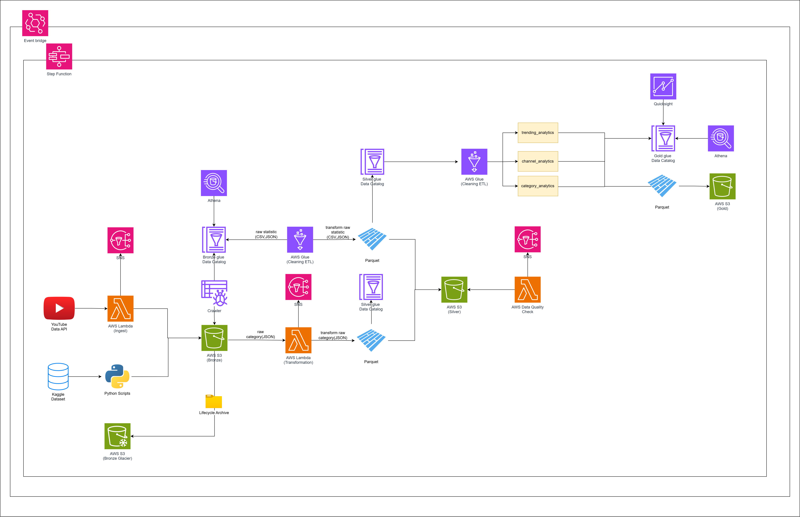

# YouTube Trending Data Pipeline on AWS — Complete Beginner's GUI Guide

## Table of Contents

1. [What You Are Building](#1-what-you-are-building)
2. [Architecture Overview](#2-architecture-overview)
3. [Data Sources — Understanding Both Inputs](#3-data-sources--understanding-both-inputs)
   - [Source 1 — Kaggle Historical Dataset](#source-1--kaggle-historical-dataset-batch--backfill)
   - [Source 2 — YouTube Data API v3](#source-2--youtube-data-api-v3-live--incremental)
4. [Prerequisites](#4-prerequisites)
5. [Phase 1 — AWS Account & Region Setup](#5-phase-1--aws-account--region-setup)
6. [Phase 2 — Create S3 Buckets (Data Lake)](#6-phase-2--create-s3-buckets-data-lake)
7. [Phase 3 — Create SNS Alert Topic](#7-phase-3--create-sns-alert-topic)
8. [Phase 4 — Create IAM Roles & Permissions](#8-phase-4--create-iam-roles--permissions)
9. [Phase 5 — Create Glue Databases (Data Catalog)](#9-phase-5--create-glue-databases-data-catalog)
10. [Phase 6 — Deploy Lambda Functions](#10-phase-6--deploy-lambda-functions)
11. [Phase 7 — Upload Glue Job Scripts to S3](#11-phase-7--upload-glue-job-scripts-to-s3)
12. [Phase 8 — Create Glue Jobs](#12-phase-8--create-glue-jobs)
13. [Phase 9 — Create Step Functions State Machine](#13-phase-9--create-step-functions-state-machine)
14. [Phase 10 — Schedule with EventBridge](#14-phase-10--schedule-with-eventbridge)
15. [Phase 11 — Upload Historical Kaggle Data to Bronze Layer](#15-phase-11--upload-historical-kaggle-data-to-bronze-layer)
16. [Phase 12 — Run & Monitor the Pipeline](#16-phase-12--run--monitor-the-pipeline)
17. [Phase 13 — Query Data with Athena](#17-phase-13--query-data-with-athena)
18. [Troubleshooting Common Errors](#18-troubleshooting-common-errors)
19. [Cost Estimate & Cleanup](#19-cost-estimate--cleanup)

---

## 1. What You Are Building

You are building a fully automated, cloud-native **data pipeline** that:

- **Fetches** YouTube trending video data from 10 countries every few hours using the YouTube Data API
- **Stores** raw data in Amazon S3 (the "Bronze" layer)
- **Cleans and transforms** data using AWS Glue PySpark jobs (the "Silver" layer)
- **Validates** data quality with a Lambda function — halting the pipeline if data looks bad
- **Produces** three analytics-ready tables (the "Gold" layer): trending analytics, channel analytics, and category analytics
- **Orchestrates** every step automatically using AWS Step Functions
- **Alerts** you by email if anything fails, using Amazon SNS
- **Queries** the final data using Amazon Athena with plain SQL

This pattern is called **Medallion Architecture (Bronze → Silver → Gold)** and is used by professional data engineering teams at companies like Netflix and Airbnb.

---

## 2. Architecture Overview



**DevOps additions on top of the AWS data pipeline above:**

- **Terraform** (`terraform/`) provisions every AWS resource shown here — S3, Lambda, Glue, Step Functions, EventBridge, SNS, Athena, IAM, ECR, Secrets Manager — plus a dedicated **EKS** cluster that hosts a read-only pipeline monitoring dashboard. See `DEPLOYMENT.md` for the one-time setup required before this can run.
- **Docker** packages each Lambda (`lambdas/*/Dockerfile`, `data_quality/Dockerfile`) as a container image; Lambda functions run as `package_type = "Image"`, pulling from **Amazon ECR**.
- **GitHub Actions** (`.github/workflows/`) builds and pushes those images, runs `terraform apply` behind a manual-approval gate, and rolls out the dashboard to EKS on every push to `main`; `terraform-plan.yml` posts a plan preview on pull requests.
- **Kubernetes** (`k8s/`): the dashboard (`dashboard/`, a small Flask app) runs as a `Deployment` + `NodePort Service` in EKS, authenticated to AWS via IRSA, showing recent Step Functions executions, data-quality results, and Gold table row counts.

**AWS Services Used:**

| Service | Role |
|---|---|
| Amazon S3 | Stores all data (Bronze/Silver/Gold layers) |
| AWS Lambda | Ingests YouTube API data; validates data quality |
| AWS Glue | Runs PySpark ETL jobs (cleaning, transforming, aggregating) |
| AWS Glue Data Catalog | Stores table schemas so Athena can query them |
| AWS Step Functions | Orchestrates the entire pipeline in order |
| Amazon EventBridge | Schedules the pipeline to run every N hours |
| Amazon SNS | Sends email alerts on pipeline success/failure |
| Amazon Athena | Lets you query Gold data with SQL |
| AWS IAM | Manages permissions for all services |
| Amazon CloudWatch | Stores logs from Lambda and Glue jobs |

---

## 3. Data Sources — Understanding Both Inputs

This pipeline is powered by **two data sources that cover the same topic — YouTube trending videos — but across completely different time periods.** That is the entire reason both exist.

> **The core idea in one sentence:** The YouTube API can only tell you what is trending *right now*. It has no memory of the past. The Kaggle dataset is a frozen historical record of what was trending in **2017–2018** — data that no longer exists anywhere in the live API. Together they form a continuous timeline: Kaggle provides the historical foundation, the API keeps building on top of it every time the pipeline runs.

```
Timeline of data coverage:

  2017 ────────── 2018 ──────────────────────────── 2026 (today) ──▶ future
  │                   │                              │
  └───── Kaggle ───────┘                             └──── YouTube API ────▶
         (static,                                          (live, grows every
          uploaded once,                                    6 hours automatically)
          never changes)

  └──────────────────────── Silver layer (merged) ──────────────────────────▶
                            Gold analytics see the full picture
```

Think of it exactly like a newspaper archive: old editions live in the library (Kaggle), today's edition arrives fresh off the press (API). Same newspaper. Same topic. Different time periods. Combined, you get a complete historical record.

---

### Source 1 — Kaggle Historical Dataset (Batch / Backfill)

**What it is:**
The Kaggle dataset is a pre-collected, static CSV dump of YouTube trending video data that was gathered over several months across 10 countries. It was compiled by Mitchell J and is publicly available at:
[https://www.kaggle.com/datasets/datasnaek/youtube-new](https://www.kaggle.com/datasets/datasnaek/youtube-new)

**What files it contains:**

| File | What It Contains |
|---|---|
| `USvideos.csv` | Rows of trending video metadata for the United States |
| `GBvideos.csv` | Same for United Kingdom |
| `CAvideos.csv` | Same for Canada |
| `DEvideos.csv` | Same for Germany |
| `FRvideos.csv` | Same for France |
| `INvideos.csv` | Same for India |
| `JPvideos.csv` | Same for Japan |
| `KRvideos.csv` | Same for South Korea |
| `MXvideos.csv` | Same for Mexico |
| `RUvideos.csv` | Same for Russia |
| `US_category_id.json` | Maps numeric category IDs (e.g., `10`) to names (e.g., `Music`) for the US |
| `GB_category_id.json` | Same mapping for UK |
| *(one JSON per region)* | ... |

**What a single CSV row looks like:**

```
video_id, trending_date, title, channel_title, category_id, publish_time, tags,
views, likes, dislikes, comment_count, thumbnail_link, comments_disabled,
ratings_disabled, video_error_or_removed, description
```

**Why this source exists in the pipeline:**

The YouTube Data API has no historical memory. If you call it today, you get today's trending list — nothing else. The API cannot tell you what was trending on March 15, 2018. That data is simply gone from the API forever.

The Kaggle dataset captures exactly that lost window: **trending video records from 2017 to 2018**, collected and preserved by a researcher before that data became inaccessible. Without it, your pipeline would have no historical baseline — your analytics tables would only contain data from the moment you first ran the pipeline forward.

With it, the moment you run the pipeline for the first time, your Gold analytics tables already have **months of trending history** to analyse trends, compare regions, and rank channels — before a single live API call has even been made.

**Role in the pipeline:**

```
Kaggle CSV files
      │
      ▼
Manually uploaded to S3 Bronze bucket (one-time operation)
      │
      ▼
Glue Job: bronze_to_silver_statistics.py
(reads the CSVs, cleans them, merges with API data format)
      │
      ▼
Silver layer (unified Parquet format, same schema as API data)
      │
      ▼
Gold layer analytics (historical trends included)
```

**Key characteristics:**

- **Static** — does not update automatically; it is a fixed historical snapshot
- **Large** — covers months of trending data across 10 regions (hundreds of thousands of rows)
- **One-time load** — you upload it once to S3 at the start of the project (Phase 11 of this guide)
- **CSV format** — raw comma-separated files, not structured for analytics yet
- **Contains a schema difference** — the CSV files use `views`, `likes`, `dislikes` as column names; the API returns `viewCount`, `likeCount`, `commentCount`. The Glue Bronze→Silver job handles this normalization, unifying both into the same Silver schema
- **Category IDs are numeric** — the JSON files (`US_category_id.json`, etc.) are needed to translate `category_id=10` into `category_name=Music`; these are uploaded to Bronze as reference data

---

### Source 2 — YouTube Data API v3 (Live / Incremental)

**What it is:**
The YouTube Data API v3 is a Google-provided REST API that lets you programmatically fetch YouTube data in real time. It is the live, ongoing data feed for this pipeline.

**How to get access:** You create an API key in Google Cloud Console (covered in Prerequisites, Step 3.1). The free tier provides **10,000 quota units per day**, which is enough for several pipeline runs.

**What the Ingestion Lambda fetches:**

Each time the pipeline runs, the Lambda function (`yt-ingest`) makes two types of API calls per region:

**Call 1 — Trending Videos:**
```
GET https://www.googleapis.com/youtube/v3/videos
    ?part=snippet,statistics
    &chart=mostPopular
    &regionCode=US
    &maxResults=50
    &key=YOUR_API_KEY
```
This returns the current **top 50 trending videos** in that country, with full metadata and statistics.

**Call 2 — Category Mappings:**
```
GET https://www.googleapis.com/youtube/v3/videoCategories
    ?part=snippet
    &regionCode=US
    &key=YOUR_API_KEY
```
This returns the current category ID-to-name mapping for that region (same purpose as the Kaggle JSON files, but fetched live).

**Why this source exists in the pipeline:**

The Kaggle dataset is frozen in 2017–2018 and will never update. Without the API, your pipeline would analyse only old data and become increasingly stale over time. The API is what makes the pipeline **live and ongoing** — every 6 hours it captures a new snapshot of what is trending right now and appends it to the same Bronze S3 bucket that the Kaggle data already sits in. Over weeks and months, these API snapshots stack up and the dataset keeps growing automatically.

**What a single API response item looks like (simplified):**

```json
{
  "id": "dQw4w9WgXcQ",
  "snippet": {
    "title": "Rick Astley - Never Gonna Give You Up",
    "channelTitle": "Rick Astley",
    "categoryId": "10",
    "publishedAt": "2009-10-25T06:57:33Z"
  },
  "statistics": {
    "viewCount": "1400000000",
    "likeCount": "16000000",
    "commentCount": "2300000"
  }
}
```

**Role in the pipeline:**

```
YouTube Data API v3 (live call, every 6 hours)
      │
      ▼
Lambda: yt-ingest
(fetches 50 videos × 10 regions = up to 500 video records per run)
      │
      ▼
Saved as raw JSON to S3 Bronze bucket
Path: youtube/raw_statistics/region=US/date=2026-05-11/hour=06/data.json
      │
      ▼
Glue Job: bronze_to_silver_statistics.py
(reads the JSON, flattens nested structure, computes derived metrics)
      │
      ▼
Silver layer (same unified Parquet schema as Kaggle data)
      │
      ▼
Gold layer analytics (current/recent trends)
```

**Key characteristics:**

- **Live** — reflects what is trending right now, updated every time the pipeline runs
- **Automated** — fully triggered by EventBridge on a schedule (no manual action needed)
- **Small per run** — 50 videos × 10 regions = ~500 records per run (much smaller than Kaggle)
- **JSON format** — nested JSON that the Glue job must flatten into tabular columns
- **Has quota limits** — 10,000 units/day free; fetching 10 regions costs ~1,000 units (safe for ~10 runs/day)
- **Provides recency** — gives you data the Kaggle dataset can never have: what is trending today

---

### How Both Sources Work Together

This is the key insight that makes this pipeline professionally designed:

```
┌─────────────────────────────────────────────────────────────────────┐
│                         BRONZE LAYER (S3)                           │
│                                                                     │
│  Kaggle CSV files (historical, months of data, uploaded once)       │
│  youtube/raw_statistics/region=US/date=2019-01-01/USvideos.csv      │
│  youtube/raw_statistics/region=US/date=2019-01-02/USvideos.csv      │
│  ...                                                                │
│                                                                     │
│  API JSON files (live, 500 records per run, updated every 6 hours)  │
│  youtube/raw_statistics/region=US/date=2026-05-11/hour=00/data.json │
│  youtube/raw_statistics/region=US/date=2026-05-11/hour=06/data.json │
│  ...                                                                │
└─────────────────────────────────────────────────────────────────────┘
                              │
                              ▼
          Glue Job: bronze_to_silver_statistics.py
          (reads ALL files regardless of format,
           maps both CSV columns and JSON fields
           to the same unified Silver schema)
                              │
                              ▼
┌─────────────────────────────────────────────────────────────────────┐
│                         SILVER LAYER (S3)                           │
│  One unified Parquet dataset — historical + live data merged        │
│  Columns: video_id, title, channel_title, category_id,             │
│           view_count, like_count, comment_count, like_ratio,        │
│           engagement_rate, trending_date, region                    │
└─────────────────────────────────────────────────────────────────────┘
                              │
                              ▼
                    Gold Layer Analytics
          (queries span both historical and live data)
```

**In plain English:** The Kaggle data answers "what happened before?", and the YouTube API answers "what is happening right now?". The Glue Silver job treats both identically, so your Gold analytics tables always contain the complete picture — months of history plus the freshest trending data from today.

---

### Side-by-Side Comparison

| Dimension | Kaggle Dataset | YouTube Data API v3 |
|---|---|---|
| **Time period covered** | 2017–2018 (historical, no longer in API) | Today and going forward (current & future) |
| **Data topic** | YouTube trending videos | YouTube trending videos (same topic) |
| **Why you need it** | API has no memory of the past; this is the only source of that era's data | Kaggle is frozen; this keeps the dataset growing beyond 2018 |
| **Data freshness** | Static — will never change or update | Live — new snapshot every 6 hours |
| **Update frequency** | Never — one-time upload | Automated every 6 hours via EventBridge |
| **How it enters pipeline** | Manually uploaded to S3 Bronze once | Lambda fetches and saves automatically |
| **Format** | CSV (flat, comma-separated) | JSON (nested object structure) |
| **Volume** | Hundreds of thousands of rows total | ~500 rows per run |
| **Category data** | Separate `_category_id.json` files | Fetched live per region per run |
| **Cost** | Free (one-time S3 upload) | Free up to 10,000 API units/day |
| **Requires credentials?** | No — public dataset on Kaggle | Yes — YouTube API Key from Google Cloud |
| **Column names** | `views`, `likes`, `dislikes` | `viewCount`, `likeCount` (nested in `statistics`) |

---

### Where to Download the Kaggle Dataset

1. Go to [https://www.kaggle.com/datasets/datasnaek/youtube-new](https://www.kaggle.com/datasets/datasnaek/youtube-new)
2. Click **Download** (you need a free Kaggle account)
3. Extract the ZIP — you will get the 10 CSV files and 10 JSON files
4. Place them inside the `data/` folder of the cloned repository
5. These files are uploaded to S3 in **Phase 11** of this guide

> **Note:** The repo already includes these files in the `data/` folder. If you downloaded the repo ZIP, they are already there and you do not need to download from Kaggle separately.
>
> In **Phase 11**, use the `scripts/aws_copy.sh` script to upload these files into your S3 bucket. The script is located at `youtube-data-piepline-aws-s3-lambda-glue-athena-stepfunction/scripts/aws_copy.sh`.

---

## 4. Prerequisites

Before starting, gather these:

### 3.1 YouTube Data API v3 Key

1. Go to [https://console.cloud.google.com](https://console.cloud.google.com)
2. Sign in with a Google account
3. Click **Select a project** → **New Project** → name it `youtube-pipeline` → **Create**
4. In the left menu, click **APIs & Services** → **Library**
5. Search for **YouTube Data API v3** → click it → click **Enable**
6. Go to **APIs & Services** → **Credentials** → **Create Credentials** → **API Key**
7. Copy the key — it looks like `AIzaSyAbc123...` — save it somewhere safe

### 3.2 Clone the Repository

Download the project files to your computer:
- Go to [https://github.com/darshilparmar/youtube-data-piepline-aws-s3-lambda-glue-athena-stepfunction](https://github.com/darshilparmar/youtube-data-piepline-aws-s3-lambda-glue-athena-stepfunction)
- Click the green **Code** button → **Download ZIP**
- Extract the ZIP to a folder, e.g., `C:\youtube-pipeline` or `~/youtube-pipeline`

### 3.3 AWS Account

- Create a free-tier AWS account at [https://aws.amazon.com](https://aws.amazon.com) if you don't have one
- You will need a credit card for signup, but most steps in this guide stay within the free tier

---

## 4. Phase 1 — AWS Account & Region Setup

### Step 1.1 — Log In to AWS Console

1. Go to [https://console.aws.amazon.com](https://console.aws.amazon.com)
2. Sign in with your email and password

### Step 1.2 — Choose Your Region

> **Why this matters:** All resources must be in the same region or cross-region costs and complexity increase.

1. In the top-right corner of the AWS Console, click the **region dropdown** (it shows something like `N. Virginia` or `us-east-1`)
2. Select **US East (N. Virginia) — us-east-1**

> Stick to `us-east-1` for this entire guide. Every resource you create must be in this same region.

---

## 6. Phase 2 — Create S3 Buckets (Data Lake)

You need **3 S3 buckets**. S3 bucket names must be globally unique — no two people on Earth can have the same bucket name. Use your AWS account ID as a suffix to make them unique.

> **Why S3 before IAM?** You need to know your bucket names before you configure IAM policies and Lambda environment variables. Creating buckets first means you have the exact names ready to copy throughout the rest of the guide.

### Step 2.0 — Find Your AWS Account ID

1. In the top-right corner of the AWS Console, click your **account name**
2. Note your **Account ID** (12-digit number like `123456789012`) — you'll use it in bucket names

### Step 2.1 — Open S3 Console

1. In the top search bar, type **S3** → click **S3**

### Step 2.2 — Create the Bronze Bucket (Raw Data)

1. Click **Create bucket** (orange button)
2. Under **Bucket name**, type: `yt-pipeline-bronze-us-east-1-YOUR_ACCOUNT_ID`
   - Example: `yt-pipeline-bronze-us-east-1-123456789012`
3. Under **AWS Region**, make sure it shows **US East (N. Virginia) us-east-1**
4. Leave all other settings at their defaults
5. Scroll down and click **Create bucket**

### Step 2.3 — Create the Silver Bucket (Cleaned Data)

1. Click **Create bucket**
2. Name: `yt-pipeline-silver-us-east-1-YOUR_ACCOUNT_ID`
3. Region: **US East (N. Virginia) us-east-1**
4. Click **Create bucket**

### Step 2.4 — Create the Gold Bucket (Analytics Data)

1. Click **Create bucket**
2. Name: `yt-pipeline-gold-us-east-1-YOUR_ACCOUNT_ID`
3. Region: **US East (N. Virginia) us-east-1**
4. Click **Create bucket**

### Step 2.5 — Create Folder Structure in Bronze Bucket

1. Click on your **bronze bucket** name to open it
2. Click **Create folder**
3. Folder name: `youtube` → click **Create folder**
4. Click into the `youtube` folder → **Create folder** → name: `raw_statistics` → **Create folder**
5. Go back into `youtube` → **Create folder** → name: `raw_statistics_reference_data` → **Create folder**

> The final structure should be:
> ```
> yt-pipeline-bronze-.../
>   youtube/
>     raw_statistics/
>     raw_statistics_reference_data/
> ```

---

## 7. Phase 3 — Create SNS Alert Topic

SNS sends you email alerts when the pipeline succeeds or fails.

> **Why SNS before IAM?** Once the SNS topic is created you'll have its ARN. You need that ARN to paste into Lambda environment variables and Step Functions — setting it up now means you won't have to backtrack later.

### Step 3.1 — Open SNS Console

1. In the top search bar, type **SNS** → click **Simple Notification Service**

### Step 3.2 — Create the Topic

1. In the left sidebar, click **Topics**
2. Click **Create topic**
3. Under **Type**, select **Standard**
4. Under **Name**, type: `yt-pipeline-alerts`
5. Scroll down and click **Create topic**

### Step 3.3 — Subscribe Your Email

1. After the topic is created, you'll be on the topic detail page
2. Scroll down to **Subscriptions** → click **Create subscription**
3. Under **Protocol**, select **Email**
4. Under **Endpoint**, type your email address
5. Click **Create subscription**
6. **Check your email inbox** — you'll receive a confirmation email from AWS
7. Click **Confirm subscription** in that email

> Copy the **Topic ARN** from the top of the topic page — it looks like `arn:aws:sns:us-east-1:123456789012:yt-pipeline-alerts`. Save it — you'll need it later.

---

## 8. Phase 4 — Create IAM Roles & Permissions

IAM (Identity and Access Management) controls what each AWS service is allowed to do. You need to create four roles: one for Lambda, one for Glue, one for Step Functions, and one for EventBridge.

> **Why IAM after S3 and SNS?** IAM roles don't reference specific bucket names or topic ARNs in managed policies — so the order doesn't affect correctness. However, having your bucket names and SNS ARN already confirmed makes it easier to verify you're configuring the right resources throughout this section.

### Step 4.1 — Open IAM Console

1. In the top search bar, type **IAM** → click **IAM** (the first result)

### Step 4.2 — Create the Lambda Execution Role

1. In the left sidebar, click **Roles**
2. Click **Create role** (orange button, top right)
3. Under **Trusted entity type**, select **AWS service**
4. Under **Use case**, select **Lambda** → click **Next**
5. In the search box, add these policies one by one (search, check, search again):
   - `AmazonS3FullAccess`
   - `AWSGlueConsoleFullAccess`
   - `AmazonSNSFullAccess`
   - `CloudWatchFullAccess`
   - `AmazonAthenaFullAccess`
6. Click **Next**
7. Under **Role name**, type: `yt-pipeline-lambda-role`
8. Click **Create role**

> **Beginner note:** In production, you would restrict permissions further (principle of least privilege). For this learning project, the above permissions are fine.

### Step 4.3 — Create the Glue Job Role

1. Click **Create role** again
2. Under **Trusted entity type**, select **AWS service**
3. Under **Use case**, scroll down and select **Glue** → click **Next**
4. Add these policies:
   - `AmazonS3FullAccess`
   - `AWSGlueConsoleFullAccess`
   - `CloudWatchFullAccess`
   - `AmazonAthenaFullAccess`
5. Click **Next**
6. Under **Role name**, type: `yt-pipeline-glue-role`
7. Click **Create role**

### Step 4.4 — Create the Step Functions Role

1. Click **Create role** again
2. Under **Trusted entity type**, select **AWS service**
3. Under **Use case**, scroll down and select **Step Functions** → click **Next**
4. Add these policies:
   - `AWSLambdaFullAccess`
   - `AWSGlueConsoleFullAccess`
   - `CloudWatchFullAccess`
5. Click **Next**
6. Under **Role name**, type: `yt-pipeline-stepfunctions-role`
7. Click **Create role**

### Step 4.5 — Create the EventBridge Role

1. Click **Create role** again
2. Under **Trusted entity type**, select **AWS service**
3. Under **Use case**, type **EventBridge** in the search box → select **EventBridge** → click **Next**
4. Add this policy:
   - `AWSStepFunctionsFullAccess`
5. Click **Next**
6. Under **Role name**, type: `yt-pipeline-eventbridge-role`
7. Click **Create role**

---

## 9. Phase 5 — Create Glue Databases (Data Catalog)

The Glue Data Catalog stores the schema (structure) of your data so Athena can query it.

### Step 5.1 — Open Glue Console

1. In the top search bar, type **Glue** → click **AWS Glue**

### Step 5.2 — Create the Bronze Database

1. In the left sidebar, click **Databases** (under Data Catalog)
2. Click **Add database**
3. Under **Database name**, type: `yt_pipeline_bronze_db`
4. Click **Create database**

### Step 5.3 — Create the Silver Database

1. Click **Add database** again
2. Name: `yt_pipeline_silver_db`
3. Click **Create database**

### Step 5.4 — Create the Gold Database

1. Click **Add database** again
2. Name: `yt_pipeline_gold_db`
3. Click **Create database**

---

## 9. Phase 6 — Deploy Lambda Functions

You need to deploy **3 Lambda functions**:
- `yt-ingest` — Fetches YouTube API data into the Bronze S3 bucket
- `yt-json-to-parquet` — Converts JSON category reference files to Parquet format
- `yt-data-quality` — Validates Silver data quality before Gold processing

### Step 6.1 — Open Lambda Console

1. In the top search bar, type **Lambda** → click **Lambda**

---

### Lambda 1: YouTube API Ingestion Function

#### Step 6.2 — Create the Function

1. Click **Create function** (orange button)
2. Select **Author from scratch**
3. **Function name:** `yt-ingest`
4. **Runtime:** Python 3.11
5. Under **Permissions**, expand **Change default execution role**
6. Select **Use an existing role** → from the dropdown, choose `yt-pipeline-lambda-role`
7. Click **Create function**

#### Step 6.3 — Add the Code

1. On the function page, scroll down to **Code source**
2. Click on the file `lambda_function.py` in the file tree on the left
3. Delete all existing code
4. Paste in the following code:

```python
"""
Lambda: YouTube Data API Ingestion (Bronze Layer)
Triggered by Step Functions / EventBridge on a schedule (e.g., every 6 hours).
Pulls trending videos from the YouTube Data API for each configured region
and writes raw JSON responses to the Bronze S3 bucket.
"""

import json
import os
import logging
from datetime import datetime, timezone
from urllib.request import urlopen, Request
from urllib.error import HTTPError, URLError
from urllib.parse import urlencode

import boto3

# ── Logging ───────────────────────────────────────────────────────────────────
logger = logging.getLogger()
logger.setLevel(logging.INFO)

# ── AWS Clients ───────────────────────────────────────────────────────────────
s3_client = boto3.client("s3")
sns_client = boto3.client("sns")

# ── Config (from environment variables) ──────────────────────────────────────
API_KEY = os.environ["YOUTUBE_API_KEY"]
BUCKET = os.environ["S3_BUCKET_BRONZE"]
REGIONS = os.environ.get("YOUTUBE_REGIONS", "US,GB,CA,DE,FR,IN,JP,KR,MX,RU").split(",")
SNS_TOPIC = os.environ.get("SNS_ALERT_TOPIC_ARN", "")
API_BASE = "https://www.googleapis.com/youtube/v3"
MAX_RESULTS = 50


def fetch_trending_videos(region_code: str) -> dict:
    """Call the YouTube Data API to get current trending videos for a region."""
    params = urlencode({
        "part": "snippet,statistics,contentDetails",
        "chart": "mostPopular",
        "regionCode": region_code,
        "maxResults": MAX_RESULTS,
        "key": API_KEY,
    })
    url = f"{API_BASE}/videos?{params}"
    req = Request(url, headers={"Accept": "application/json"})
    with urlopen(req, timeout=30) as resp:
        return json.loads(resp.read().decode("utf-8"))


def fetch_video_categories(region_code: str) -> dict:
    """Fetch the video category mapping for a region (replaces static Kaggle JSON files)."""
    params = urlencode({
        "part": "snippet",
        "regionCode": region_code,
        "key": API_KEY,
    })
    url = f"{API_BASE}/videoCategories?{params}"
    req = Request(url, headers={"Accept": "application/json"})
    with urlopen(req, timeout=30) as resp:
        return json.loads(resp.read().decode("utf-8"))


def write_to_s3(data: dict, bucket: str, key: str):
    """Write JSON data to S3 with ingestion metadata."""
    body = json.dumps(data, ensure_ascii=False, indent=2)
    s3_client.put_object(
        Bucket=bucket,
        Key=key,
        Body=body.encode("utf-8"),
        ContentType="application/json",
        Metadata={
            "ingestion_timestamp": datetime.now(timezone.utc).isoformat(),
            "source": "youtube_data_api_v3",
        },
    )


def send_alert(subject: str, message: str):
    """Send failure alert via SNS."""
    if SNS_TOPIC:
        sns_client.publish(
            TopicArn=SNS_TOPIC,
            Subject=subject[:100],
            Message=message,
        )


def lambda_handler(event, context):
    """
    Main handler. Iterates over regions, fetches trending videos
    and category mappings, writes everything to the Bronze S3 layer.
    """
    now = datetime.now(timezone.utc)
    date_partition = now.strftime("%Y-%m-%d")
    hour_partition = now.strftime("%H")
    ingestion_id = now.strftime("%Y%m%d_%H%M%S")

    results = {"success": [], "failed": []}

    for region in REGIONS:
        region = region.strip().upper()
        logger.info(f"Processing region: {region}")

        # ── Fetch trending videos ─────────────────────────────────────────────
        try:
            trending_data = fetch_trending_videos(region)
            video_count = len(trending_data.get("items", []))

            # Add pipeline metadata into the raw response before saving
            trending_data["_pipeline_metadata"] = {
                "ingestion_id": ingestion_id,
                "region": region,
                "ingestion_timestamp": now.isoformat(),
                "video_count": video_count,
                "source": "youtube_data_api_v3",
            }

            # Hive-style partitioned S3 key:
            # youtube/raw_statistics/region=US/date=2026-05-11/hour=14/20260511_140000.json
            s3_key = (
                f"youtube/raw_statistics/"
                f"region={region}/"
                f"date={date_partition}/"
                f"hour={hour_partition}/"
                f"{ingestion_id}.json"
            )
            write_to_s3(trending_data, BUCKET, s3_key)
            logger.info(f"  Wrote {video_count} videos → s3://{BUCKET}/{s3_key}")

        except (HTTPError, URLError) as e:
            logger.error(f"  API error for {region} trending: {e}")
            results["failed"].append({"region": region, "type": "trending", "error": str(e)})
            continue
        except Exception as e:
            logger.error(f"  Unexpected error for {region} trending: {e}")
            results["failed"].append({"region": region, "type": "trending", "error": str(e)})
            continue

        # ── Fetch category reference data ─────────────────────────────────────
        try:
            category_data = fetch_video_categories(region)
            category_data["_pipeline_metadata"] = {
                "ingestion_id": ingestion_id,
                "region": region,
                "ingestion_timestamp": now.isoformat(),
                "source": "youtube_data_api_v3",
            }

            # Saved under reference_data with date partition for idempotency
            ref_key = (
                f"youtube/raw_statistics_reference_data/"
                f"region={region}/"
                f"date={date_partition}/"
                f"{region}_category_id.json"
            )
            write_to_s3(category_data, BUCKET, ref_key)
            logger.info(f"  Wrote categories → s3://{BUCKET}/{ref_key}")

        except (HTTPError, URLError) as e:
            logger.error(f"  API error for {region} categories: {e}")
            results["failed"].append({"region": region, "type": "categories", "error": str(e)})
            continue

        results["success"].append(region)

    # ── Summary & alerting ────────────────────────────────────────────────────
    summary = (
        f"Ingestion {ingestion_id} complete. "
        f"Success: {len(results['success'])}/{len(REGIONS)} regions. "
        f"Failed: {len(results['failed'])}."
    )
    logger.info(summary)

    if results["failed"]:
        send_alert(
            subject=f"[YT Pipeline] Ingestion partial failure — {ingestion_id}",
            message=json.dumps(results, indent=2),
        )

    return {
        "statusCode": 200,
        "ingestion_id": ingestion_id,
        "results": results,
    }
```

5. Click **Deploy** (orange button above the code editor)

#### Step 6.4 — Set Environment Variables

1. Click the **Configuration** tab (just above the code editor)
2. Click **Environment variables** in the left sub-menu
3. Click **Edit**
4. Click **Add environment variable** and add each row:

| Key | Value |
|---|---|
| `YOUTUBE_API_KEY` | `AIzaSy...` (your actual YouTube API key) |
| `S3_BUCKET_BRONZE` | `yt-pipeline-bronze-us-east-1-YOUR_ACCOUNT_ID` |
| `YOUTUBE_REGIONS` | `US,GB,CA,DE,FR,IN,JP,KR,MX,RU` |
| `SNS_ALERT_TOPIC_ARN` | `arn:aws:sns:us-east-1:YOUR_ACCOUNT_ID:yt-pipeline-alerts` |

5. Click **Save**

#### Step 6.5 — Increase Timeout and Memory

1. Still in the **Configuration** tab, click **General configuration** → **Edit**
2. Change **Timeout** to `5 min 0 sec`
3. Change **Memory** to `256 MB`
4. Click **Save**

> **No Lambda Layer needed** for `yt-ingest` — this function uses only Python standard library modules (`json`, `urllib`, `os`, `logging`, `datetime`) and `boto3`, which is pre-installed in all Lambda runtimes.

---

### Lambda 2: JSON to Parquet Reference Data Function

#### Step 6.6 — Create the Function

1. Click **Functions** in the left sidebar → **Create function**
2. Select **Author from scratch**
3. **Function name:** `yt-json-to-parquet`
4. **Runtime:** Python 3.11
5. **Execution role:** Use existing → `yt-pipeline-lambda-role`
6. Click **Create function**

#### Step 6.7 — Add a Lambda Layer (AWS SDK for Pandas)

This function needs `awswrangler` and `pandas` libraries which are not included in the default Lambda runtime. AWS provides them as a managed layer.

1. On the function page, scroll down to the **Layers** section (below the code editor)
2. Click **Add a layer**
3. Select **AWS layers**
4. From the **Name** dropdown, choose **AWSSDKPandas-Python311**
5. Select the **latest version number** from the Version dropdown
6. Click **Add**

> **Important:** Make sure you select `AWSSDKPandas-Python311` (not Python39 or Python310) — it must match the Python 3.11 runtime you selected above.

#### Step 6.8 — Add the Code

1. Click the **Code** tab → click `lambda_function.py` in the file tree
2. Delete all existing code → paste the following:

```python
"""
Lambda: JSON Reference Data → Silver Layer (Parquet)
Triggered by Step Functions after the ingestion Lambda completes.
Reads category JSON files from Bronze S3 and writes them as Parquet
to the Silver layer, registering the table in the Glue Data Catalog.

Key design decision: Uses boto3 + json.loads instead of wr.s3.read_json()
because the YouTube/Kaggle category JSON has mixed types (strings like
"kind"/"etag" alongside a nested "items" array) which causes pandas to
fail with ambiguous ordering errors. Reading raw bytes and normalizing
only the "items" array sidesteps this cleanly.
"""

import json
import os
import logging
from datetime import datetime, timezone
from urllib.parse import unquote_plus

import boto3
import awswrangler as wr
import pandas as pd

# ── Logging ───────────────────────────────────────────────────────────────────
logger = logging.getLogger()
logger.setLevel(logging.INFO)

# ── Config (from environment variables) ──────────────────────────────────────
SILVER_BUCKET = os.environ["S3_BUCKET_SILVER"]
GLUE_DB = os.environ.get("GLUE_DB_SILVER", "yt_pipeline_silver_dev")
GLUE_TABLE = os.environ.get("GLUE_TABLE_REFERENCE", "clean_reference_data")
SNS_TOPIC = os.environ.get("SNS_ALERT_TOPIC_ARN", "")
SILVER_PATH = f"s3://{SILVER_BUCKET}/youtube/reference_data/"

s3_client = boto3.client("s3")
sns_client = boto3.client("sns")


def read_json_from_s3(bucket: str, key: str) -> dict:
    """
    Read raw JSON from S3 using boto3 + json.loads.
    We avoid wr.s3.read_json() here because the category JSON has mixed
    types (top-level strings + a nested items array) that pandas cannot
    parse directly into a DataFrame without ambiguous ordering errors.
    """
    response = s3_client.get_object(Bucket=bucket, Key=key)
    content = response["Body"].read().decode("utf-8")
    return json.loads(content)


def validate_category_data(df: pd.DataFrame) -> pd.DataFrame:
    """Validate and deduplicate the category reference DataFrame."""
    if df.empty:
        raise ValueError("Empty DataFrame — no category items found in JSON")

    # Deduplicate on category ID (keep last in case of duplicates)
    if "id" in df.columns:
        before = len(df)
        df = df.drop_duplicates(subset=["id"], keep="last")
        removed = before - len(df)
        if removed:
            logger.info(f"  Removed {removed} duplicate category rows")

    return df


def send_alert(subject: str, message: str):
    """Send failure alert via SNS."""
    if SNS_TOPIC:
        sns_client.publish(TopicArn=SNS_TOPIC, Subject=subject[:100], Message=message)


def lambda_handler(event, context):
    """
    Process S3 event records for new JSON reference files, OR scan all
    reference JSON files when invoked directly by Step Functions (no Records).
    Converts each JSON category file to Parquet in the Silver layer and
    registers the table in the Glue Data Catalog.
    """
    # Handle both S3-event-triggered and Step Functions direct invocations
    records = event.get("Records", [])

    # If invoked by Step Functions (no Records), scan entire reference prefix
    if not records:
        logger.info("No S3 Records in event — scanning full reference_data prefix")
        bronze_bucket = os.environ.get("S3_BUCKET_BRONZE", "")
        paginator = s3_client.get_paginator("list_objects_v2")
        pages = paginator.paginate(
            Bucket=bronze_bucket,
            Prefix="youtube/raw_statistics_reference_data/"
        )
        for page in pages:
            for obj in page.get("Contents", []):
                if obj["Key"].endswith(".json"):
                    records.append({
                        "s3": {
                            "bucket": {"name": bronze_bucket},
                            "object": {"key": obj["Key"]}
                        }
                    })

    processed = []
    errors = []

    for record in records:
        key = "unknown"
        try:
            s3_info = record["s3"]
            bucket = s3_info["bucket"]["name"]
            key = unquote_plus(s3_info["object"]["key"])

            if not key.endswith(".json"):
                continue

            logger.info(f"Processing: s3://{bucket}/{key}")

            # ── Read raw JSON ─────────────────────────────────────────────────
            raw_data = read_json_from_s3(bucket, key)

            # YouTube/Kaggle category JSON structure: { "kind": ..., "items": [...] }
            # We only care about the items array
            if "items" in raw_data and isinstance(raw_data["items"], list):
                df = pd.json_normalize(raw_data["items"])
            else:
                df = pd.json_normalize(raw_data)

            logger.info(f"  Raw shape: {df.shape}")

            # ── Validate & clean ──────────────────────────────────────────────
            df = validate_category_data(df)

            # ── Add metadata columns ──────────────────────────────────────────
            df["_ingestion_timestamp"] = datetime.now(timezone.utc).isoformat()
            df["_source_file"] = key

            # Extract region from S3 key (e.g., region=US/... → "US")
            region = "unknown"
            for part in key.split("/"):
                if part.startswith("region="):
                    region = part.split("=")[1]
                    break
            df["region"] = region

            logger.info(f"  Clean shape: {df.shape}, region: {region}")

            # ── Write to Silver as partitioned Parquet ────────────────────────
            wr.s3.to_parquet(
                df=df,
                path=SILVER_PATH,
                dataset=True,
                database=GLUE_DB,
                table=GLUE_TABLE,
                partition_cols=["region"],
                mode="overwrite_partitions",   # Idempotent: safe to re-run
                schema_evolution=True,
            )

            logger.info(f"  Written to Silver: {SILVER_PATH}region={region}/")
            processed.append({"key": key, "region": region, "rows": len(df)})

        except Exception as e:
            logger.error(f"Error processing {key}: {e}", exc_info=True)
            errors.append({"key": key, "error": str(e)})

    # ── Alert on any errors ───────────────────────────────────────────────────
    if errors:
        send_alert(
            subject="[YT Pipeline] Silver reference transform failed",
            message=json.dumps(errors, indent=2),
        )

    return {
        "statusCode": 200,
        "processed": processed,
        "errors": errors,
    }
```

3. Click **Deploy**

#### Step 6.9 — Set Environment Variables

1. Click **Configuration** → **Environment variables** → **Edit** → **Add environment variable**:

| Key | Value |
|---|---|
| `S3_BUCKET_BRONZE` | `yt-pipeline-bronze-us-east-1-YOUR_ACCOUNT_ID` |
| `S3_BUCKET_SILVER` | `yt-pipeline-silver-us-east-1-YOUR_ACCOUNT_ID` |
| `GLUE_DB_SILVER` | `yt_pipeline_silver_db` |
| `GLUE_TABLE_REFERENCE` | `clean_reference_data` |
| `SNS_ALERT_TOPIC_ARN` | `arn:aws:sns:us-east-1:YOUR_ACCOUNT_ID:yt-pipeline-alerts` |

2. Click **Save**

#### Step 6.10 — Increase Timeout and Memory

1. **Configuration** → **General configuration** → **Edit**
2. Set **Timeout** to `5 min 0 sec`
3. Set **Memory** to `512 MB` (pandas + awswrangler need more memory than the default 128 MB)
4. Click **Save**

---

### Lambda 3: Data Quality Validation Function

#### Step 6.11 — Create the Function

1. Click **Functions** → **Create function**
2. Select **Author from scratch**
3. **Function name:** `yt-data-quality`
4. **Runtime:** Python 3.11
5. **Execution role:** Use existing → `yt-pipeline-lambda-role`
6. Click **Create function**

#### Step 6.12 — Add the Lambda Layer

1. Scroll down to the **Layers** section → click **Add a layer**
2. Select **AWS layers**
3. From the **Name** dropdown, choose **AWSSDKPandas-Python311**
4. Select the **latest version number**
5. Click **Add**

#### Step 6.13 — Add the Code

1. Click the **Code** tab → click `lambda_function.py` in the file tree
2. Delete all existing code → paste the following:

```python
"""
Lambda: Data Quality Checks
Called by Step Functions after the Silver layer is built.
Validates data quality before allowing the Gold aggregation to proceed.

Checks performed:
  1. Row count         — is there enough data?
  2. Null percentage   — are critical columns populated?
  3. Schema validation — do expected columns exist?
  4. Value range       — are numeric values reasonable?
  5. Freshness         — is the data recent enough?

If any check fails, an SNS alert is published and the Lambda raises
an exception, which causes Step Functions to halt the pipeline.
"""

import os
import json
import logging
from datetime import datetime, timezone, timedelta

import boto3
import awswrangler as wr
import pandas as pd

logger = logging.getLogger()
logger.setLevel(logging.INFO)

sns_client = boto3.client("sns")
SNS_TOPIC = os.environ.get("SNS_ALERT_TOPIC_ARN", "")

# ── Thresholds (overridable via environment variables) ────────────────────────
MIN_ROW_COUNT  = int(os.environ.get("DQ_MIN_ROW_COUNT",    "10"))
MAX_NULL_PCT   = float(os.environ.get("DQ_MAX_NULL_PERCENT", "5.0"))
MAX_VIEWS      = 50_000_000_000   # 50B — sanity cap for view counts
FRESHNESS_HOURS = 48

# Expected critical columns per Silver table
CRITICAL_COLUMNS = {
    "clean_statistics":    ["video_id", "title", "channel_title", "views", "region"],
    "clean_reference_data": ["id", "region"],
}


def check_row_count(df: pd.DataFrame, table_name: str) -> dict:
    count = len(df)
    passed = count >= MIN_ROW_COUNT
    return {
        "check": "row_count", "table": table_name,
        "value": count, "threshold": MIN_ROW_COUNT, "passed": passed,
        "message": f"Row count: {count} (min required: {MIN_ROW_COUNT})",
    }


def check_null_percentage(df: pd.DataFrame, table_name: str) -> list:
    results = []
    for col in CRITICAL_COLUMNS.get(table_name, []):
        if col not in df.columns:
            results.append({
                "check": "null_pct", "table": table_name, "column": col,
                "passed": False, "message": f"Column '{col}' is missing from table",
            })
            continue
        null_pct = (df[col].isna().sum() / len(df)) * 100 if len(df) > 0 else 0
        passed = null_pct <= MAX_NULL_PCT
        results.append({
            "check": "null_pct", "table": table_name, "column": col,
            "value": round(null_pct, 2), "threshold": MAX_NULL_PCT, "passed": passed,
            "message": f"{col} null%: {null_pct:.2f}% (max allowed: {MAX_NULL_PCT}%)",
        })
    return results


def check_schema(df: pd.DataFrame, table_name: str) -> dict:
    expected = set(CRITICAL_COLUMNS.get(table_name, []))
    missing  = expected - set(df.columns)
    passed   = len(missing) == 0
    return {
        "check": "schema", "table": table_name,
        "missing_columns": list(missing), "passed": passed,
        "message": f"Missing columns: {missing}" if missing else "All expected columns present",
    }


def check_value_ranges(df: pd.DataFrame, table_name: str) -> list:
    results = []
    if table_name != "clean_statistics" or "views" not in df.columns:
        return results
    negative = int((df["views"] < 0).sum())
    extreme  = int((df["views"] > MAX_VIEWS).sum())
    passed   = negative == 0 and extreme == 0
    results.append({
        "check": "value_range", "table": table_name, "column": "views",
        "negative_count": negative, "extreme_count": extreme, "passed": passed,
        "message": f"Views: {negative} negative values, {extreme} values above {MAX_VIEWS}",
    })
    return results


def check_freshness(df: pd.DataFrame, table_name: str) -> dict:
    """Check that the Silver data contains recent records."""
    ts_col = next(
        (c for c in ["_processed_at", "_ingestion_timestamp"] if c in df.columns),
        None
    )
    if ts_col is None:
        return {
            "check": "freshness", "table": table_name, "passed": True,
            "message": "No timestamp column found — skipping freshness check (backfill data)",
        }
    try:
        latest = pd.to_datetime(df[ts_col]).max()
        cutoff = datetime.now(timezone.utc) - timedelta(hours=FRESHNESS_HOURS)
        if latest.tzinfo is None:
            latest = latest.replace(tzinfo=timezone.utc)
        passed = latest >= cutoff
        return {
            "check": "freshness", "table": table_name,
            "latest_record": str(latest), "cutoff": str(cutoff), "passed": passed,
            "message": f"Latest record: {latest} | Cutoff: {cutoff}",
        }
    except Exception as e:
        return {
            "check": "freshness", "table": table_name, "passed": True,
            "message": f"Could not parse timestamps ({e}) — skipping",
        }


def lambda_handler(event, context):
    """
    Run all data quality checks on the specified Silver tables.

    Expected event shape (sent by Step Functions):
    {
        "database": "yt_pipeline_silver_db",
        "tables":   ["clean_statistics", "clean_reference_data"]
    }

    Returns a result dict. Raises an exception if any check fails,
    which causes Step Functions to route to the failure branch.
    """
    database = event.get("database", os.environ.get("GLUE_DB_SILVER", "yt_pipeline_silver_db"))
    tables   = event.get("tables", ["clean_statistics"])

    all_results   = []
    overall_passed = True

    for table_name in tables:
        logger.info(f"Running DQ checks on {database}.{table_name} ...")

        try:
            # Read a bounded sample for cost & speed (Athena charges per byte scanned)
            df = wr.athena.read_sql_query(
                sql=f'SELECT * FROM "{table_name}" LIMIT 10000',
                database=database,
                ctas_approach=False,
            )
        except Exception as e:
            logger.error(f"Could not read {table_name}: {e}")
            all_results.append({
                "check": "read_table", "table": table_name,
                "passed": False, "message": str(e),
            })
            overall_passed = False
            continue

        checks = [
            check_row_count(df, table_name),
            *check_null_percentage(df, table_name),
            check_schema(df, table_name),
            *check_value_ranges(df, table_name),
            check_freshness(df, table_name),
        ]

        for chk in checks:
            status = "PASS" if chk["passed"] else "FAIL"
            logger.info(f"  [{status}] {chk['check']}: {chk['message']}")
            if not chk["passed"]:
                overall_passed = False

        all_results.extend(checks)

    # ── Summary logging ───────────────────────────────────────────────────────
    passed_count = sum(1 for r in all_results if r["passed"])
    total_count  = len(all_results)
    verdict = "PASS" if overall_passed else "FAIL"
    logger.info(f"DQ Summary: {passed_count}/{total_count} checks passed — Overall: {verdict}")

    # ── Alert and halt if any checks failed ───────────────────────────────────
    if not overall_passed and SNS_TOPIC:
        failed = [r for r in all_results if not r["passed"]]
        sns_client.publish(
            TopicArn=SNS_TOPIC,
            Subject="[YT Pipeline] Data quality checks FAILED — pipeline halted",
            Message=json.dumps(failed, indent=2, default=str),
        )
        raise Exception(
            f"Data quality FAILED: {len(failed)} check(s) did not pass. "
            "Pipeline halted. Check SNS alert for details."
        )

    return {
        "quality_passed":  bool(overall_passed),
        "checks_passed":   int(passed_count),
        "checks_total":    int(total_count),
        "details": json.loads(json.dumps(all_results, default=str)),
    }
```

2. Click **Deploy**

#### Step 6.14 — Set Environment Variables

1. **Configuration** → **Environment variables** → **Edit** → add:

| Key | Value |
|---|---|
| `GLUE_DB_SILVER` | `yt_pipeline_silver_db` |
| `SNS_ALERT_TOPIC_ARN` | `arn:aws:sns:us-east-1:YOUR_ACCOUNT_ID:yt-pipeline-alerts` |
| `DQ_MIN_ROW_COUNT` | `10` |
| `DQ_MAX_NULL_PERCENT` | `5.0` |

2. Click **Save**

#### Step 6.15 — Increase Timeout and Memory

1. **Configuration** → **General configuration** → **Edit**
2. Set **Timeout** to `5 min 0 sec`
3. Set **Memory** to `512 MB`
4. Click **Save**

> **How this function integrates with Step Functions:** The `yt-data-quality` Lambda is called by Step Functions after the Silver Glue job completes. It queries Silver tables via Athena and returns `quality_passed: true` on success. If any check fails, it raises an exception — Step Functions catches this and routes to the `NotifyFailure` state, sending you an SNS email and halting the pipeline before Gold aggregation runs on bad data.

---

## 10. Phase 7 — Upload Glue Job Scripts to S3

Glue runs PySpark jobs from `.py` script files stored in S3. You will save both scripts locally from the repo, then upload them to your **Bronze bucket** under a dedicated `glue_scripts/` folder.

> **Why the Bronze bucket?** The Scripts bucket was removed from this guide to keep things simple. Glue scripts are small text files — storing them in a sub-folder of the Bronze bucket is perfectly fine and saves you managing a fourth bucket.

### Step 7.0 — Create a Folder for Scripts in the Bronze Bucket

1. Go to **S3 Console** → open your **bronze bucket**: `yt-pipeline-bronze-us-east-1-YOUR_ACCOUNT_ID`
2. Click **Create folder** → name it `glue_scripts` → click **Create folder**

---

### Step 7.1 — Prepare the Bronze → Silver Script

In your downloaded repo folder, find `glue_jobs/bronze_to_silver_statistics.py`. Save the file locally with this exact content:

```python
"""
Glue Job: Bronze → Silver (Statistics Data)
────────────────────────────────────────────
Reads raw CSV/JSON statistics from the Bronze layer,
applies schema enforcement, data cleansing, deduplication,
and writes clean Parquet to the Silver layer.

Key capabilities:
  - Handles BOTH Kaggle CSV format and live YouTube API JSON format
  - Schema enforcement: casts all columns to correct types
  - Date parsing: converts Kaggle YY.DD.MM format to proper dates
  - Deduplication: keeps latest record per video + region + date
  - Derived metrics: like_ratio, engagement_rate
  - Inline DQ warnings logged to CloudWatch
  - Writes Parquet to Silver and registers table in Glue Catalog
    (no separate Crawler needed — enableUpdateCatalog=True handles it)

Job Parameters (passed by Step Functions at runtime):
    --JOB_NAME         — Glue job name (auto-set by Glue)
    --bronze_database  — Bronze Glue catalog database
    --bronze_table     — Bronze statistics table name
    --silver_bucket    — Silver S3 bucket name
    --silver_database  — Silver Glue catalog database
    --silver_table     — Silver statistics table name
"""

import sys
from datetime import datetime

from awsglue.transforms import *
from awsglue.utils import getResolvedOptions
from pyspark.context import SparkContext
from awsglue.context import GlueContext
from awsglue.job import Job
from awsglue.dynamicframe import DynamicFrame

from pyspark.sql import functions as F
from pyspark.sql.types import (
    StructType, StructField, StringType, LongType, BooleanType, TimestampType
)

# ── Job Setup ─────────────────────────────────────────────────────────────────
args = getResolvedOptions(sys.argv, [
    "JOB_NAME",
    "bronze_database",
    "bronze_table",
    "silver_bucket",
    "silver_database",
    "silver_table",
])

sc = SparkContext()
glueContext = GlueContext(sc)
spark = glueContext.spark_session
job = Job(glueContext)
job.init(args["JOB_NAME"], args)
logger = glueContext.get_logger()

# ── Config ────────────────────────────────────────────────────────────────────
BRONZE_DB    = args["bronze_database"]
BRONZE_TABLE = args["bronze_table"]
SILVER_BUCKET = args["silver_bucket"]
SILVER_DB    = args["silver_database"]
SILVER_TABLE = args["silver_table"]
SILVER_PATH  = f"s3://{SILVER_BUCKET}/youtube/statistics/"

logger.info(f"Bronze: {BRONZE_DB}.{BRONZE_TABLE}")
logger.info(f"Silver: {SILVER_DB}.{SILVER_TABLE} → {SILVER_PATH}")


# ── Step 1: Read from Bronze Catalog ─────────────────────────────────────────
logger.info("Reading from Bronze catalog...")

# Predicate pushdown filters partitions at the S3 level before loading into Spark
# — reduces data scanned and speeds up the job significantly
predicate = "region in ('ca','gb','us', 'in')"

datasource = glueContext.create_dynamic_frame.from_catalog(
    database=BRONZE_DB,
    table_name=BRONZE_TABLE,
    transformation_ctx="datasource",
    push_down_predicate=predicate,
)

df = datasource.toDF()
initial_count = df.count()
logger.info(f"Bronze records read: {initial_count}")

if initial_count == 0:
    logger.info("No new records to process. Committing empty job.")
else:
    # ── Step 2: Schema Enforcement ────────────────────────────────────────────
    logger.info("Enforcing schema and casting types...")

    # Detect which format we are dealing with by checking for API-specific column names
    columns = set(df.columns)

    if "snippet.title" in columns or "snippet__title" in columns:
        # ── YouTube API JSON format — flatten nested structure ─────────────────
        # The API returns nested objects: snippet.title, statistics.viewCount, etc.
        # Glue may represent dots as either "snippet.title" (with backtick quoting)
        # or "snippet__title" (double underscore). We handle both.
        logger.info("Detected YouTube API format — flattening nested fields...")
        df = df.select(
            F.col("id").alias("video_id"),
            F.lit(datetime.utcnow().strftime("%y.%d.%m")).alias("trending_date"),
            F.col("`snippet.title`").alias("title") if "snippet.title" in columns
                else F.col("snippet__title").alias("title"),
            F.col("`snippet.channelTitle`").alias("channel_title") if "snippet.channelTitle" in columns
                else F.col("snippet__channelTitle").alias("channel_title"),
            F.col("`snippet.categoryId`").cast(LongType()).alias("category_id") if "snippet.categoryId" in columns
                else F.col("snippet__categoryId").cast(LongType()).alias("category_id"),
            F.col("`snippet.publishedAt`").alias("publish_time") if "snippet.publishedAt" in columns
                else F.col("snippet__publishedAt").alias("publish_time"),
            F.col("`snippet.tags`").alias("tags") if "snippet.tags" in columns
                else F.lit(None).cast(StringType()).alias("tags"),
            F.col("`statistics.viewCount`").cast(LongType()).alias("views") if "statistics.viewCount" in columns
                else F.col("statistics__viewCount").cast(LongType()).alias("views"),
            F.col("`statistics.likeCount`").cast(LongType()).alias("likes") if "statistics.likeCount" in columns
                else F.col("statistics__likeCount").cast(LongType()).alias("likes"),
            F.col("`statistics.dislikeCount`").cast(LongType()).alias("dislikes") if "statistics.dislikeCount" in columns
                else F.lit(0).cast(LongType()).alias("dislikes"),
            F.col("`statistics.commentCount`").cast(LongType()).alias("comment_count") if "statistics.commentCount" in columns
                else F.col("statistics__commentCount").cast(LongType()).alias("comment_count"),
            F.col("`snippet.thumbnails.default.url`").alias("thumbnail_link") if "snippet.thumbnails.default.url" in columns
                else F.lit(None).cast(StringType()).alias("thumbnail_link"),
            F.lit(False).alias("comments_disabled"),
            F.lit(False).alias("ratings_disabled"),
            F.lit(False).alias("video_error_or_removed"),
            F.col("`snippet.description`").alias("description") if "snippet.description" in columns
                else F.col("snippet__description").alias("description"),
            F.col("region"),
        )
    else:
        # ── Kaggle CSV format — columns are already flat, just cast types ──────
        logger.info("Detected Kaggle CSV format — casting column types...")
        df = df.select(
            F.col("video_id").cast(StringType()),
            F.col("trending_date").cast(StringType()),
            F.col("title").cast(StringType()),
            F.col("channel_title").cast(StringType()),
            F.col("category_id").cast(LongType()),
            F.col("publish_time").cast(StringType()),
            F.col("tags").cast(StringType()),
            F.col("views").cast(LongType()),
            F.col("likes").cast(LongType()),
            F.col("dislikes").cast(LongType()),
            F.col("comment_count").cast(LongType()),
            F.col("thumbnail_link").cast(StringType()),
            F.col("comments_disabled").cast(BooleanType()),
            F.col("ratings_disabled").cast(BooleanType()),
            F.col("video_error_or_removed").cast(BooleanType()),
            F.col("description").cast(StringType()),
            F.col("region").cast(StringType()),
        )


    # ── Step 3: Data Cleansing ────────────────────────────────────────────────
    logger.info("Cleansing data...")

    # Drop rows where video_id is null — these are completely corrupt records
    df = df.filter(F.col("video_id").isNotNull())

    # Standardize region to lowercase for consistent partitioning
    df = df.withColumn("region", F.lower(F.trim(F.col("region"))))

    # Parse trending_date to a proper DATE type
    # Kaggle format is YY.DD.MM (e.g. "17.14.11" = Nov 14, 2017)
    # API format is YYYY-MM-DD
    df = df.withColumn(
        "trending_date_parsed",
        F.when(
            F.col("trending_date").rlike(r"^\d{2}\.\d{2}\.\d{2}$"),
            F.to_date(F.col("trending_date"), "yy.dd.MM")
        ).otherwise(
            F.to_date(F.col("trending_date"))
        )
    )

    # Fill nulls in numeric columns with 0 rather than dropping rows
    for col_name in ["views", "likes", "dislikes", "comment_count"]:
        df = df.withColumn(col_name, F.coalesce(F.col(col_name), F.lit(0)))

    # ── Derived metrics ───────────────────────────────────────────────────────
    # like_ratio: likes as a percentage of total views
    df = df.withColumn("like_ratio",
        F.when(F.col("views") > 0,
            F.round(F.col("likes") / F.col("views") * 100, 4)
        ).otherwise(0.0)
    )
    # engagement_rate: (likes + dislikes + comments) as a percentage of views
    df = df.withColumn("engagement_rate",
        F.when(F.col("views") > 0,
            F.round((F.col("likes") + F.col("dislikes") + F.col("comment_count")) / F.col("views") * 100, 4)
        ).otherwise(0.0)
    )

    # Add pipeline processing metadata
    df = df.withColumn("_processed_at", F.current_timestamp())
    df = df.withColumn("_job_name", F.lit(args["JOB_NAME"]))


    # ── Step 4: Deduplication ─────────────────────────────────────────────────
    logger.info("Deduplicating...")

    # A video can appear in multiple daily ingestion runs. We keep only the
    # most recently processed record per (video_id, region, trending_date).
    from pyspark.sql.window import Window

    window = Window.partitionBy("video_id", "region", "trending_date_parsed") \
        .orderBy(F.col("_processed_at").desc())

    df = df.withColumn("_row_num", F.row_number().over(window)) \
        .filter(F.col("_row_num") == 1) \
        .drop("_row_num")

    clean_count = df.count()
    logger.info(f"After cleansing & dedup: {clean_count} records (removed {initial_count - clean_count})")


    # ── Step 5: Inline Data Quality Warnings ─────────────────────────────────
    logger.info("Running inline DQ checks...")

    null_counts = {}
    for col_name in ["video_id", "title", "channel_title", "views"]:
        null_count = df.filter(F.col(col_name).isNull()).count()
        null_counts[col_name] = null_count
        if null_count > 0:
            logger.warn(f"  DQ WARNING: {col_name} has {null_count} null values")

    negative_views = df.filter(F.col("views") < 0).count()
    if negative_views > 0:
        logger.warn(f"  DQ WARNING: {negative_views} records with negative views")

    logger.info(f"  DQ check complete. Null counts: {null_counts}")


    # ── Step 6: Write to Silver Layer ─────────────────────────────────────────
    logger.info(f"Writing to Silver: {SILVER_PATH}")

    # getSink with enableUpdateCatalog=True automatically creates/updates the
    # Glue Catalog table — no separate Crawler run needed after this job.
    dynamic_frame = DynamicFrame.fromDF(df, glueContext, "silver_statistics")

    sink = glueContext.getSink(
        connection_type="s3",
        path=SILVER_PATH,
        enableUpdateCatalog=True,
        updateBehavior="UPDATE_IN_DATABASE",
        partitionKeys=["region"],
    )
    sink.setCatalogInfo(catalogDatabase=SILVER_DB, catalogTableName=SILVER_TABLE)
    sink.setFormat("glueparquet", compression="snappy")
    sink.writeFrame(dynamic_frame)

    logger.info(f"Silver write complete. {clean_count} records written.")

job.commit()
```

---

### Step 7.2 — Prepare the Silver → Gold Script

# ── Job Setup ─────────────────────────────────────────────────────────────────
args = getResolvedOptions(sys.argv, [
    "JOB_NAME",
    "bronze_database",
    "bronze_table",
    "silver_bucket",
    "silver_database",
    "silver_table",
])

sc = SparkContext()
glueContext = GlueContext(sc)
spark = glueContext.spark_session
job = Job(glueContext)
job.init(args["JOB_NAME"], args)
logger = glueContext.get_logger()

# ── Config ────────────────────────────────────────────────────────────────────
BRONZE_DB    = args["bronze_database"]
BRONZE_TABLE = args["bronze_table"]
SILVER_BUCKET = args["silver_bucket"]
SILVER_DB    = args["silver_database"]
SILVER_TABLE = args["silver_table"]
SILVER_PATH  = f"s3://{SILVER_BUCKET}/youtube/statistics/"

logger.info(f"Bronze: {BRONZE_DB}.{BRONZE_TABLE}")
logger.info(f"Silver: {SILVER_DB}.{SILVER_TABLE} → {SILVER_PATH}")


# ── Step 1: Read from Bronze ──────────────────────────────────────────────────
logger.info("Reading from Bronze catalog...")

# Predicate pushdown — include both upper and lowercase to handle either partition format
predicate = "region in ('ca','gb','us', 'in')"

datasource = glueContext.create_dynamic_frame.from_catalog(
    database=BRONZE_DB,
    table_name=BRONZE_TABLE,
    transformation_ctx="datasource",
    push_down_predicate=predicate,
)

df = datasource.toDF()
initial_count = df.count()
logger.info(f"Bronze records read: {initial_count}")

if initial_count == 0:
    logger.info("No new records to process. Committing empty job.")
else:
    # ── Step 2: Schema Enforcement ────────────────────────────────────────────
    logger.info("Enforcing schema and casting types...")

    # Handle both Kaggle CSV format and YouTube API JSON format
    columns = set(df.columns)

    if "snippet.title" in columns or "snippet__title" in columns:
        # YouTube API format — flatten nested structure
        logger.info("Detected YouTube API format — flattening...")
        df = df.select(
            F.col("id").alias("video_id"),
            F.lit(datetime.utcnow().strftime("%y.%d.%m")).alias("trending_date"),
            F.col("`snippet.title`").alias("title") if "snippet.title" in columns
                else F.col("snippet__title").alias("title"),
            F.col("`snippet.channelTitle`").alias("channel_title") if "snippet.channelTitle" in columns
                else F.col("snippet__channelTitle").alias("channel_title"),
            F.col("`snippet.categoryId`").cast(LongType()).alias("category_id") if "snippet.categoryId" in columns
                else F.col("snippet__categoryId").cast(LongType()).alias("category_id"),
            F.col("`snippet.publishedAt`").alias("publish_time") if "snippet.publishedAt" in columns
                else F.col("snippet__publishedAt").alias("publish_time"),
            F.col("`snippet.tags`").alias("tags") if "snippet.tags" in columns
                else F.lit(None).cast(StringType()).alias("tags"),
            F.col("`statistics.viewCount`").cast(LongType()).alias("views") if "statistics.viewCount" in columns
                else F.col("statistics__viewCount").cast(LongType()).alias("views"),
            F.col("`statistics.likeCount`").cast(LongType()).alias("likes") if "statistics.likeCount" in columns
                else F.col("statistics__likeCount").cast(LongType()).alias("likes"),
            F.col("`statistics.dislikeCount`").cast(LongType()).alias("dislikes") if "statistics.dislikeCount" in columns
                else F.lit(0).cast(LongType()).alias("dislikes"),
            F.col("`statistics.commentCount`").cast(LongType()).alias("comment_count") if "statistics.commentCount" in columns
                else F.col("statistics__commentCount").cast(LongType()).alias("comment_count"),
            F.col("`snippet.thumbnails.default.url`").alias("thumbnail_link") if "snippet.thumbnails.default.url" in columns
                else F.lit(None).cast(StringType()).alias("thumbnail_link"),
            F.lit(False).alias("comments_disabled"),
            F.lit(False).alias("ratings_disabled"),
            F.lit(False).alias("video_error_or_removed"),
            F.col("`snippet.description`").alias("description") if "snippet.description" in columns
                else F.col("snippet__description").alias("description"),
            F.col("region"),
        )
    else:
        # Kaggle CSV format — just cast types
        logger.info("Detected Kaggle CSV format — casting types...")
        df = df.select(
            F.col("video_id").cast(StringType()),
            F.col("trending_date").cast(StringType()),
            F.col("title").cast(StringType()),
            F.col("channel_title").cast(StringType()),
            F.col("category_id").cast(LongType()),
            F.col("publish_time").cast(StringType()),
            F.col("tags").cast(StringType()),
            F.col("views").cast(LongType()),
            F.col("likes").cast(LongType()),
            F.col("dislikes").cast(LongType()),
            F.col("comment_count").cast(LongType()),
            F.col("thumbnail_link").cast(StringType()),
            F.col("comments_disabled").cast(BooleanType()),
            F.col("ratings_disabled").cast(BooleanType()),
            F.col("video_error_or_removed").cast(BooleanType()),
            F.col("description").cast(StringType()),
            F.col("region").cast(StringType()),
        )


    # ── Step 3: Data Cleansing ────────────────────────────────────────────────
    logger.info("Cleansing data...")

    # Remove records where video_id is null (corrupt rows)
    df = df.filter(F.col("video_id").isNotNull())

    # Standardize region codes to lower
    df = df.withColumn("region", F.lower(F.trim(F.col("region"))))

    # Parse trending_date from Kaggle format (YY.DD.MM) to proper date
    df = df.withColumn(
        "trending_date_parsed",
        F.when(
            F.col("trending_date").rlike(r"^\d{2}\.\d{2}\.\d{2}$"),
            F.to_date(F.col("trending_date"), "yy.dd.MM")
        ).otherwise(
            F.to_date(F.col("trending_date"))
        )
    )

    # Fill nulls for numeric columns with 0
    numeric_cols = ["views", "likes", "dislikes", "comment_count"]
    for col_name in numeric_cols:
        df = df.withColumn(col_name, F.coalesce(F.col(col_name), F.lit(0)))

    # Add derived columns
    df = df.withColumn("like_ratio",
        F.when(
            (F.col("views") > 0),
            F.round(F.col("likes") / F.col("views") * 100, 4)
        ).otherwise(0.0)
    )
    df = df.withColumn("engagement_rate",
        F.when(
            (F.col("views") > 0),
            F.round((F.col("likes") + F.col("dislikes") + F.col("comment_count")) / F.col("views") * 100, 4)
        ).otherwise(0.0)
    )

    # Add processing metadata
    df = df.withColumn("_processed_at", F.current_timestamp())
    df = df.withColumn("_job_name", F.lit(args["JOB_NAME"]))


    # ── Step 4: Deduplication ─────────────────────────────────────────────────
    logger.info("Deduplicating...")

    # Keep the latest record per video_id + region + trending_date
    from pyspark.sql.window import Window

    window = Window.partitionBy("video_id", "region", "trending_date_parsed") \
        .orderBy(F.col("_processed_at").desc())

    df = df.withColumn("_row_num", F.row_number().over(window)) \
        .filter(F.col("_row_num") == 1) \
        .drop("_row_num")

    clean_count = df.count()
    logger.info(f"After cleansing & dedup: {clean_count} records (removed {initial_count - clean_count})")


    # ── Step 5: Data Quality Checks ───────────────────────────────────────────
    logger.info("Running data quality checks...")

    null_counts = {}
    for col_name in ["video_id", "title", "channel_title", "views"]:
        null_count = df.filter(F.col(col_name).isNull()).count()
        null_counts[col_name] = null_count
        if null_count > 0:
            logger.warn(f"  DQ WARNING: {col_name} has {null_count} null values")

    negative_views = df.filter(F.col("views") < 0).count()
    if negative_views > 0:
        logger.warn(f"  DQ WARNING: {negative_views} records with negative views")

    logger.info(f"  DQ check complete. Null counts: {null_counts}")


    # ── Step 6: Write to Silver Layer ─────────────────────────────────────────
    logger.info(f"Writing to Silver: {SILVER_PATH}")

---

### Step 7.2 — Prepare the Silver → Gold Script

In your downloaded repo folder, find `glue_jobs/silver_to_gold_analytics.py`. Save the file locally with this exact content:

```python
"""
Glue Job: Silver → Gold (Analytics Aggregations)
─────────────────────────────────────────────────
Reads cleansed statistics and reference data from Silver,
joins them, and produces business-level aggregations in the Gold layer.

Gold layer tables are optimized for analytics queries in Athena/QuickSight.

Gold tables produced:
  1. trending_analytics   — Daily trending summaries per region
  2. channel_analytics    — Channel performance metrics + regional ranking
  3. category_analytics   — Category-level trends with view share % per day

Job Parameters (passed by Step Functions at runtime):
    --JOB_NAME         — Glue job name (auto-set by Glue)
    --silver_database  — Silver Glue catalog database
    --gold_bucket      — Gold S3 bucket name
    --gold_database    — Gold Glue catalog database
"""

import sys
from awsglue.utils import getResolvedOptions
from pyspark.context import SparkContext
from awsglue.context import GlueContext
from awsglue.job import Job
from awsglue.dynamicframe import DynamicFrame

from pyspark.sql import functions as F
from pyspark.sql.window import Window

# ── Job Setup ─────────────────────────────────────────────────────────────────
args = getResolvedOptions(sys.argv, [
    "JOB_NAME",
    "silver_database",
    "gold_bucket",
    "gold_database",
])

sc = SparkContext()
glueContext = GlueContext(sc)
spark = glueContext.spark_session
job = Job(glueContext)
job.init(args["JOB_NAME"], args)
logger = glueContext.get_logger()

SILVER_DB   = args["silver_database"]
GOLD_BUCKET = args["gold_bucket"]
GOLD_DB     = args["gold_database"]


# ── Read Silver Statistics Table ──────────────────────────────────────────────
logger.info("Reading Silver statistics...")

stats_dyf = glueContext.create_dynamic_frame.from_catalog(
    database=SILVER_DB,
    table_name="clean_statistics",
    transformation_ctx="stats",
)
stats_df = stats_dyf.toDF()
logger.info(f"Statistics records: {stats_df.count()}")


# ── Read Reference Data (optional) + Build Category Lookup ───────────────────
# We attempt to join category names onto the statistics data.
# If the reference table doesn't exist yet (first run), we proceed gracefully
# by falling back to "Unknown" for all category names.
logger.info("Attempting to read Silver reference data for category names...")

try:
    ref_dyf = glueContext.create_dynamic_frame.from_catalog(
        database=SILVER_DB,
        table_name="clean_reference_data",
        transformation_ctx="ref",
    )
    ref_df = ref_dyf.toDF()

    category_lookup = None

    # Glue crawlers can represent dotted field names in two ways:
    #   "snippet.title"  (original dotted name, requires backtick quoting)
    #   "snippet_title"  (underscored, from some crawler versions)
    # We check for both to be safe.
    if "id" in ref_df.columns and "snippet.title" in ref_df.columns:
        category_lookup = ref_df.select(
            F.col("id").cast("long").alias("category_id"),
            F.col("`snippet.title`").alias("category_name"),
        ).dropDuplicates(["category_id"])

    elif "id" in ref_df.columns and "snippet_title" in ref_df.columns:
        category_lookup = ref_df.select(
            F.col("id").cast("long").alias("category_id"),
            F.col("snippet_title").alias("category_name"),
        ).dropDuplicates(["category_id"])

    else:
        logger.warn(
            "Could not find expected category title columns in reference data. "
            f"Columns found: {ref_df.columns}"
        )

    if category_lookup is not None:
        logger.info(f"Category lookup entries: {category_lookup.count()}")

        # Cast category_id to long to ensure join key types match
        if "category_id" in stats_df.columns:
            stats_df = stats_df.withColumn("category_id", F.col("category_id").cast("long"))

        # broadcast() keeps the small lookup table in memory on all workers
        # — much faster than a shuffle join for a table this small
        stats_df = stats_df.join(
            F.broadcast(category_lookup),
            on="category_id",
            how="left",
        )

except Exception as e:
    logger.warn(f"Could not load reference data: {e}. Proceeding without category names.")

# Always guarantee category_name column exists for all downstream aggregations
if "category_name" not in stats_df.columns:
    stats_df = stats_df.withColumn("category_name", F.lit("Unknown"))
else:
    stats_df = stats_df.fillna("Unknown", subset=["category_name"])


# ══════════════════════════════════════════════════════════════════════════════
# GOLD TABLE 1: Trending Analytics — daily summaries per region
# ══════════════════════════════════════════════════════════════════════════════
logger.info("Building Gold table 1: trending_analytics...")

trending = stats_df.groupBy("region", "trending_date_parsed").agg(
    F.count("video_id").alias("total_videos"),
    F.sum("views").alias("total_views"),
    F.sum("likes").alias("total_likes"),
    F.sum("dislikes").alias("total_dislikes"),
    F.sum("comment_count").alias("total_comments"),
    F.avg("views").alias("avg_views_per_video"),
    F.avg("like_ratio").alias("avg_like_ratio"),
    F.avg("engagement_rate").alias("avg_engagement_rate"),
    F.max("views").alias("max_views"),
    F.countDistinct("channel_title").alias("unique_channels"),
    F.countDistinct("category_id").alias("unique_categories"),
)

trending = trending.withColumn("_aggregated_at", F.current_timestamp())

trending_path = f"s3://{GOLD_BUCKET}/youtube/trending_analytics/"
trending_dyf = DynamicFrame.fromDF(trending, glueContext, "trending")

sink1 = glueContext.getSink(
    connection_type="s3",
    path=trending_path,
    enableUpdateCatalog=True,
    updateBehavior="UPDATE_IN_DATABASE",
    partitionKeys=["region"],
)
sink1.setCatalogInfo(catalogDatabase=GOLD_DB, catalogTableName="trending_analytics")
sink1.setFormat("glueparquet", compression="snappy")
sink1.writeFrame(trending_dyf)
logger.info(f"  Written {trending.count()} rows → {trending_path}")


# ══════════════════════════════════════════════════════════════════════════════
# GOLD TABLE 2: Channel Analytics — per-channel performance metrics
# ══════════════════════════════════════════════════════════════════════════════
logger.info("Building Gold table 2: channel_analytics...")

channel = stats_df.groupBy("channel_title", "region").agg(
    F.countDistinct("video_id").alias("total_videos"),
    F.sum("views").alias("total_views"),
    F.sum("likes").alias("total_likes"),
    F.sum("comment_count").alias("total_comments"),
    F.avg("views").alias("avg_views_per_video"),
    F.avg("engagement_rate").alias("avg_engagement_rate"),
    F.max("views").alias("peak_views"),
    F.count("trending_date_parsed").alias("times_trending"),
    F.min("trending_date_parsed").alias("first_trending"),
    F.max("trending_date_parsed").alias("last_trending"),
    F.collect_set("category_name").alias("categories"),
)

# Rank channels by total views within their region (1 = most viewed channel)
window_rank = Window.partitionBy("region").orderBy(F.col("total_views").desc())
channel = channel.withColumn("rank_in_region", F.row_number().over(window_rank))
channel = channel.withColumn("_aggregated_at", F.current_timestamp())

channel_path = f"s3://{GOLD_BUCKET}/youtube/channel_analytics/"
channel_dyf = DynamicFrame.fromDF(channel, glueContext, "channel")

sink2 = glueContext.getSink(
    connection_type="s3",
    path=channel_path,
    enableUpdateCatalog=True,
    updateBehavior="UPDATE_IN_DATABASE",
    partitionKeys=["region"],
)
sink2.setCatalogInfo(catalogDatabase=GOLD_DB, catalogTableName="channel_analytics")
sink2.setFormat("glueparquet", compression="snappy")
sink2.writeFrame(channel_dyf)
logger.info(f"  Written {channel.count()} rows → {channel_path}")


# ══════════════════════════════════════════════════════════════════════════════
# GOLD TABLE 3: Category Analytics — category trends over time
# ══════════════════════════════════════════════════════════════════════════════
logger.info("Building Gold table 3: category_analytics...")

category = stats_df.groupBy("category_name", "category_id", "region", "trending_date_parsed").agg(
    F.count("video_id").alias("video_count"),
    F.sum("views").alias("total_views"),
    F.sum("likes").alias("total_likes"),
    F.sum("comment_count").alias("total_comments"),
    F.avg("engagement_rate").alias("avg_engagement_rate"),
    F.countDistinct("channel_title").alias("unique_channels"),
)

# Calculate each category's share of total views for that region on that day
# view_share_pct tells you: "Music accounted for 42% of all trending views in the US on this date"
window_total = Window.partitionBy("region", "trending_date_parsed")
category = category.withColumn(
    "view_share_pct",
    F.round(F.col("total_views") / F.sum("total_views").over(window_total) * 100, 2)
)
category = category.withColumn("_aggregated_at", F.current_timestamp())

category_path = f"s3://{GOLD_BUCKET}/youtube/category_analytics/"
category_dyf = DynamicFrame.fromDF(category, glueContext, "category")

sink3 = glueContext.getSink(
    connection_type="s3",
    path=category_path,
    enableUpdateCatalog=True,
    updateBehavior="UPDATE_IN_DATABASE",
    partitionKeys=["region"],
)
sink3.setCatalogInfo(catalogDatabase=GOLD_DB, catalogTableName="category_analytics")
sink3.setFormat("glueparquet", compression="snappy")
sink3.writeFrame(category_dyf)
logger.info(f"  Written {category.count()} rows → {category_path}")

logger.info("Gold layer build complete.")
job.commit()
```

---

### Step 7.3 — Upload Both Scripts to S3

1. Go to **S3 Console** → open your **bronze bucket**: `yt-pipeline-bronze-us-east-1-YOUR_ACCOUNT_ID`
2. Click into the `glue_scripts/` folder you created in Step 7.0
3. Click **Upload** → **Add files**
4. Select `bronze_to_silver_statistics.py` from your local machine → click **Upload**
5. Click **Upload** again → **Add files**
6. Select `silver_to_gold_analytics.py` → click **Upload**

After uploading both files, your S3 structure should look like:

```
yt-pipeline-bronze-.../
  glue_scripts/
    bronze_to_silver_statistics.py    ✅
    silver_to_gold_analytics.py       ✅
  youtube/
    raw_statistics/
    raw_statistics_reference_data/
```

> Note the full S3 paths — you will paste these into the Glue job Script path field in the next phase:
> - `s3://yt-pipeline-bronze-us-east-1-YOUR_ACCOUNT_ID/glue_scripts/bronze_to_silver_statistics.py`
> - `s3://yt-pipeline-bronze-us-east-1-YOUR_ACCOUNT_ID/glue_scripts/silver_to_gold_analytics.py`

---

## 11. Phase 8 — Create Glue Jobs

### Step 8.1 — Open the Glue Console

1. In the top search bar, type **Glue** → click **AWS Glue**
2. In the left sidebar, click **Jobs** (under ETL jobs)

---

### Step 8.2 — Create the Bronze → Silver Job

#### Create the job

1. Click **Create job** (orange button)
2. Select **Script editor**
3. Under **Engine**, select **Spark**
4. Select **Upload and edit an existing script**
5. Click **Choose file** → select `bronze_to_silver_statistics.py` from your local machine → click **Create**

> Alternatively: select **Start fresh**, delete the placeholder code, and paste the full script from Phase 7 Step 7.1.

#### Configure job details

1. Click the **Job details** tab at the top of the editor
2. Fill in the following fields:

| Setting | Value |
|---|---|
| **Name** | `yt-data-pipeline-bronze-to-silver` |
| **IAM Role** | `yt-pipeline-glue-role` |
| **Glue version** | Glue 4.0 |
| **Language** | Python 3 |
| **Worker type** | G.1X |
| **Number of workers** | `2` |
| **Job timeout (minutes)** | `60` |

3. **Script path** — point Glue to the file you uploaded:
   `s3://yt-pipeline-bronze-us-east-1-YOUR_ACCOUNT_ID/glue_scripts/bronze_to_silver_statistics.py`

4. Scroll down to **Job parameters** → click **Add new parameter** for each row below:

| Key | Value | What It Does |
|---|---|---|
| `--bronze_database` | `yt_pipeline_bronze_db` | Glue catalog DB where the Bronze table is registered |
| `--bronze_table` | `raw_statistics` | The catalog table name for raw CSV/JSON statistics |
| `--silver_bucket` | `yt-pipeline-silver-us-east-1-YOUR_ACCOUNT_ID` | S3 bucket where clean Parquet is written |
| `--silver_database` | `yt_pipeline_silver_db` | Glue catalog DB for the Silver table |
| `--silver_table` | `clean_statistics` | Catalog table name that Glue will create/update automatically |

> **Why these parameters?** The script reads them at runtime via `getResolvedOptions()`. Step Functions passes them as `--key value` arguments when it starts the Glue job — you can see the exact values in the state machine JSON in Phase 9.

5. Click **Save** (top right)

---

### Step 8.3 — Create the Silver → Gold Job

#### Create the job

1. Click **Create job**
2. Select **Script editor** → **Spark** → **Upload and edit an existing script**
3. Click **Choose file** → select `silver_to_gold_analytics.py` → click **Create**

#### Configure job details

1. Click the **Job details** tab
2. Fill in:

| Setting | Value |
|---|---|
| **Name** | `yt-data-pipeline-silver-to-gold` |
| **IAM Role** | `yt-pipeline-glue-role` |
| **Glue version** | Glue 4.0 |
| **Language** | Python 3 |
| **Worker type** | G.1X |
| **Number of workers** | `2` |
| **Job timeout (minutes)** | `60` |

3. **Script path:**
   `s3://yt-pipeline-bronze-us-east-1-YOUR_ACCOUNT_ID/glue_scripts/silver_to_gold_analytics.py`

4. **Job parameters:**

| Key | Value | What It Does |
|---|---|---|
| `--silver_database` | `yt_pipeline_silver_db` | Glue catalog DB to read clean Silver data from |
| `--gold_bucket` | `yt-pipeline-gold-us-east-1-YOUR_ACCOUNT_ID` | S3 bucket to write Gold aggregations |
| `--gold_database` | `yt_pipeline_gold_db` | Glue catalog DB where Gold tables are registered |

5. Click **Save**

---

### Step 8.4 — Verify Both Jobs Appear in the Jobs List

1. In the Glue left sidebar, click **Jobs**
2. You should see both jobs listed:
   - `yt-data-pipeline-bronze-to-silver`
   - `yt-data-pipeline-silver-to-gold`

> **Do not run them yet.** The jobs are designed to be triggered by Step Functions (Phase 9), which passes the correct `--Arguments` at runtime. Running them manually without the correct arguments will cause a `KeyError` on missing parameters.

---

### What Each Job Produces

**Bronze → Silver (`yt-data-pipeline-bronze-to-silver`):**

| Input (Bronze) | Output (Silver) |
|---|---|
| Kaggle CSVs with `views`, `likes`, `dislikes` columns | Unified Parquet with `views`, `likes`, `dislikes`, `comment_count` |
| YouTube API JSON with nested `snippet.*` / `statistics.*` | Same unified schema — flattened and cast to correct types |
| No deduplication | Deduplicated by `video_id + region + trending_date_parsed` |
| No derived metrics | `like_ratio` and `engagement_rate` computed and added |
| No metadata | `_processed_at` and `_job_name` columns added |
| Unpartitioned | Partitioned by `region` in Snappy-compressed Parquet |
| Not in Glue Catalog | Table `clean_statistics` created/updated in `yt_pipeline_silver_db` |

**Silver → Gold (`yt-data-pipeline-silver-to-gold`):**

| Gold Table | Grain | Key Metrics |
|---|---|---|
| `trending_analytics` | Region + Date | total_videos, total_views, avg_views, unique_channels, avg_engagement_rate |
| `channel_analytics` | Channel + Region | total_views, peak_views, times_trending, rank_in_region, avg_engagement_rate |
| `category_analytics` | Category + Region + Date | video_count, total_views, view_share_pct, avg_engagement_rate, unique_channels |

---

## 12. Phase 9 — Create Step Functions State Machine

Step Functions is the conductor of your pipeline. It runs every step in the correct order, handles retries automatically, evaluates data quality results, and routes to the right SNS notification state on success or failure.

### How the Pipeline Flows

```
IngestFromYouTubeAPI (Lambda: yt-ingest)
        │
        ▼
WaitForS3Consistency (10 second pause)
        │
        ▼
ProcessInParallel ──────────────────────────────────────────┐
  │                                                          │
  Branch 1: TransformReferenceData                  Branch 2: RunBronzeToSilverGlueJob
  (Lambda: yt-json-to-parquet)                      (Glue: yt-data-pipeline-bronze-to-silver)
  │                                                          │
  └────────────────── both must succeed ─────────────────────┘
        │
        ▼
RunDataQualityChecks (Lambda: yt-data-quality)
        │
        ▼
EvaluateDataQuality (Choice state)
  ├── quality_passed = true  ──▶  RunSilverToGoldGlueJob
  └── quality_passed = false ──▶  NotifyDQFailure (SNS) → END
        │
        ▼
RunSilverToGoldGlueJob (Glue: yt-data-pipeline-silver-to-gold)
        │
        ▼
NotifySuccess (SNS email) → END
```

> **Key difference from a simple pipeline:** After the data quality Lambda runs, the state machine uses a **Choice state** (`EvaluateDataQuality`) to inspect the Lambda's return value. If `quality_passed` is `false`, the pipeline routes to `NotifyDQFailure` and stops — the Gold job never runs on bad data. This is what makes the pipeline safe.

---

### Step 9.1 — Gather ARNs You Need

Before creating the state machine, collect these values from your already-created resources:

| Resource | Where to Find It | What You'll Copy |
|---|---|---|
| `yt-ingest` Lambda | Lambda → Functions → yt-ingest → top of page | Full ARN |
| `yt-json-to-parquet` Lambda | Lambda → Functions → yt-json-to-parquet → top of page | Full ARN |
| `yt-data-quality` Lambda | Lambda → Functions → yt-data-quality → top of page | Full ARN |
| SNS Topic | SNS → Topics → yt-pipeline-alerts → top of page | Full ARN |
| Bronze-to-Silver Glue job | Glue → Jobs → exact name as typed | `yt-data-pipeline-bronze-to-silver` |
| Silver-to-Gold Glue job | Glue → Jobs → exact name as typed | `yt-data-pipeline-silver-to-gold` |
| Silver bucket name | S3 → bucket name | `yt-pipeline-silver-us-east-1-YOUR_ACCOUNT_ID` |
| Gold bucket name | S3 → bucket name | `yt-pipeline-gold-us-east-1-YOUR_ACCOUNT_ID` |

### Step 9.2 — Open Step Functions Console

1. In the top search bar, type **Step Functions** → click **Step Functions**

### Step 9.3 — Create the State Machine

1. Click **Create state machine** (orange button)
2. Select **Write your workflow in code**
3. Under **Type**, select **Standard**
4. In the **Definition** editor, delete everything and paste the following JSON:

```json
{
  "Comment": "YouTube Data Pipeline — Full orchestration via Step Functions. Replaces manual execution of individual jobs.",
  "StartAt": "IngestFromYouTubeAPI",
  "States": {

    "IngestFromYouTubeAPI": {
      "Type": "Task",
      "Resource": "arn:aws:states:::lambda:invoke",
      "Parameters": {
        "FunctionName": "REPLACE_WITH_YT_INGEST_LAMBDA_ARN",
        "Payload": {
          "triggered_by": "step_functions",
          "execution_id.$": "$$.Execution.Id"
        }
      },
      "ResultPath": "$.ingestion_result",
      "Retry": [
        {
          "ErrorEquals": ["Lambda.ServiceException", "Lambda.TooManyRequestsException"],
          "IntervalSeconds": 30,
          "MaxAttempts": 3,
          "BackoffRate": 2
        }
      ],
      "Catch": [
        {
          "ErrorEquals": ["States.ALL"],
          "Next": "NotifyIngestionFailure",
          "ResultPath": "$.error"
        }
      ],
      "Next": "WaitForS3Consistency"
    },

    "WaitForS3Consistency": {
      "Type": "Wait",
      "Seconds": 10,
      "Comment": "Brief wait to ensure S3 eventual consistency for newly written objects",
      "Next": "ProcessInParallel"
    },

    "ProcessInParallel": {
      "Type": "Parallel",
      "Comment": "Run reference data transform and statistics ETL in parallel",
      "Branches": [
        {
          "StartAt": "TransformReferenceData",
          "States": {
            "TransformReferenceData": {
              "Type": "Task",
              "Resource": "arn:aws:states:::lambda:invoke",
              "Parameters": {
                "FunctionName": "REPLACE_WITH_YT_JSON_TO_PARQUET_LAMBDA_ARN",
                "Payload": {
                  "triggered_by": "step_functions"
                }
              },
              "ResultPath": "$.reference_result",
              "Retry": [
                {
                  "ErrorEquals": ["States.ALL"],
                  "IntervalSeconds": 15,
                  "MaxAttempts": 2,
                  "BackoffRate": 2
                }
              ],
              "End": true
            }
          }
        },
        {
          "StartAt": "RunBronzeToSilverGlueJob",
          "States": {
            "RunBronzeToSilverGlueJob": {
              "Type": "Task",
              "Resource": "arn:aws:states:::glue:startJobRun.sync",
              "Parameters": {
                "JobName": "yt-data-pipeline-bronze-to-silver",
                "Arguments": {
                  "--bronze_database": "yt_pipeline_bronze_db",
                  "--bronze_table": "raw_statistics",
                  "--silver_bucket": "REPLACE_WITH_SILVER_BUCKET_NAME",
                  "--silver_database": "yt_pipeline_silver_db",
                  "--silver_table": "clean_statistics"
                }
              },
              "ResultPath": "$.glue_bronze_silver_result",
              "Retry": [
                {
                  "ErrorEquals": ["States.ALL"],
                  "IntervalSeconds": 60,
                  "MaxAttempts": 2,
                  "BackoffRate": 2
                }
              ],
              "End": true
            }
          }
        }
      ],
      "ResultPath": "$.parallel_results",
      "Catch": [
        {
          "ErrorEquals": ["States.ALL"],
          "Next": "NotifyTransformFailure",
          "ResultPath": "$.error"
        }
      ],
      "Next": "RunDataQualityChecks"
    },

    "RunDataQualityChecks": {
      "Type": "Task",
      "Resource": "arn:aws:states:::lambda:invoke",
      "Parameters": {
        "FunctionName": "REPLACE_WITH_YT_DATA_QUALITY_LAMBDA_ARN",
        "Payload": {
          "layer": "silver",
          "database": "yt_pipeline_silver_db",
          "tables": ["clean_statistics", "clean_reference_data"]
        }
      },
      "ResultPath": "$.dq_result",
      "Retry": [
        {
          "ErrorEquals": ["States.ALL"],
          "IntervalSeconds": 15,
          "MaxAttempts": 2,
          "BackoffRate": 2
        }
      ],
      "Next": "EvaluateDataQuality"
    },

    "EvaluateDataQuality": {
      "Type": "Choice",
      "Comment": "Branch on the quality_passed boolean returned by the DQ Lambda",
      "Choices": [
        {
          "Variable": "$.dq_result.Payload.quality_passed",
          "BooleanEquals": true,
          "Next": "RunSilverToGoldGlueJob"
        }
      ],
      "Default": "NotifyDQFailure"
    },

    "RunSilverToGoldGlueJob": {
      "Type": "Task",
      "Resource": "arn:aws:states:::glue:startJobRun.sync",
      "Parameters": {
        "JobName": "yt-data-pipeline-silver-to-gold",
        "Arguments": {
          "--silver_database": "yt_pipeline_silver_db",
          "--gold_bucket": "REPLACE_WITH_GOLD_BUCKET_NAME",
          "--gold_database": "yt_pipeline_gold_db"
        }
      },
      "ResultPath": "$.glue_gold_result",
      "Retry": [
        {
          "ErrorEquals": ["States.ALL"],
          "IntervalSeconds": 60,
          "MaxAttempts": 2,
          "BackoffRate": 2
        }
      ],
      "Catch": [
        {
          "ErrorEquals": ["States.ALL"],
          "Next": "NotifyGoldFailure",
          "ResultPath": "$.error"
        }
      ],
      "Next": "NotifySuccess"
    },

    "NotifySuccess": {
      "Type": "Task",
      "Resource": "arn:aws:states:::sns:publish",
      "Parameters": {
        "TopicArn": "REPLACE_WITH_SNS_TOPIC_ARN",
        "Subject": "[YT Pipeline] Pipeline completed successfully",
        "Message.$": "States.Format('Pipeline run {} completed. All layers updated.', $$.Execution.Id)"
      },
      "End": true
    },

    "NotifyIngestionFailure": {
      "Type": "Task",
      "Resource": "arn:aws:states:::sns:publish",
      "Parameters": {
        "TopicArn": "REPLACE_WITH_SNS_TOPIC_ARN",
        "Subject": "[YT Pipeline] FAILURE — Ingestion step failed",
        "Message.$": "States.JsonToString($.error)"
      },
      "End": true
    },

    "NotifyTransformFailure": {
      "Type": "Task",
      "Resource": "arn:aws:states:::sns:publish",
      "Parameters": {
        "TopicArn": "REPLACE_WITH_SNS_TOPIC_ARN",
        "Subject": "[YT Pipeline] FAILURE — Transform step failed",
        "Message.$": "States.JsonToString($.error)"
      },
      "End": true
    },

    "NotifyDQFailure": {
      "Type": "Task",
      "Resource": "arn:aws:states:::sns:publish",
      "Parameters": {
        "TopicArn": "REPLACE_WITH_SNS_TOPIC_ARN",
        "Subject": "[YT Pipeline] WARNING — Data quality checks failed",
        "Message.$": "States.JsonToString($.dq_result)"
      },
      "End": true
    },

    "NotifyGoldFailure": {
      "Type": "Task",
      "Resource": "arn:aws:states:::sns:publish",
      "Parameters": {
        "TopicArn": "REPLACE_WITH_SNS_TOPIC_ARN",
        "Subject": "[YT Pipeline] FAILURE — Gold aggregation failed",
        "Message.$": "States.JsonToString($.error)"
      },
      "End": true
    }

  }
}
```

### Step 9.4 — Replace All Placeholders

Find and replace each placeholder in the JSON you just pasted. There are **7 values** to fill in:

| Placeholder | Replace With | Where to Find It |
|---|---|---|
| `REPLACE_WITH_YT_INGEST_LAMBDA_ARN` | Your `yt-ingest` function ARN | Lambda → Functions → yt-ingest → copy ARN from top of page |
| `REPLACE_WITH_YT_JSON_TO_PARQUET_LAMBDA_ARN` | Your `yt-json-to-parquet` function ARN | Lambda → Functions → yt-json-to-parquet → copy ARN |
| `REPLACE_WITH_YT_DATA_QUALITY_LAMBDA_ARN` | Your `yt-data-quality` function ARN | Lambda → Functions → yt-data-quality → copy ARN |
| `REPLACE_WITH_SILVER_BUCKET_NAME` | `yt-pipeline-silver-us-east-1-YOUR_ACCOUNT_ID` | Your actual Silver bucket name (no `s3://`) |
| `REPLACE_WITH_GOLD_BUCKET_NAME` | `yt-pipeline-gold-us-east-1-YOUR_ACCOUNT_ID` | Your actual Gold bucket name (no `s3://`) |
| `REPLACE_WITH_SNS_TOPIC_ARN` | Your SNS topic ARN | SNS → Topics → yt-pipeline-alerts → copy ARN |

> **Note:** `REPLACE_WITH_SNS_TOPIC_ARN` appears **5 times** in the JSON — once per notification state (`NotifySuccess`, `NotifyIngestionFailure`, `NotifyTransformFailure`, `NotifyDQFailure`, `NotifyGoldFailure`). Replace all 5 occurrences with the same SNS ARN.

> **Tip:** Use your text editor's Find & Replace (`Ctrl+H` on Windows / `Cmd+H` on Mac) to replace all occurrences at once before pasting into the AWS console.

### Step 9.5 — Finish Creating the State Machine

1. After replacing all placeholders, click **Next**
2. **State machine name:** `yt-data-pipeline`
3. Under **Permissions**, select **Choose an existing role** → select `yt-pipeline-stepfunctions-role`
4. Under **Logging**, select **ALL** log level and point to a CloudWatch log group (optional but recommended for debugging)
5. Click **Create state machine**
6. After creation, copy the **State machine ARN** from the top of the page — you'll need it for EventBridge in the next phase

---

## 13. Phase 10 — Schedule with EventBridge

EventBridge automatically triggers your pipeline on a schedule.

### Step 10.1 — Open EventBridge Console

1. In the top search bar, type **EventBridge** → click **Amazon EventBridge**

### Step 10.2 — Create a Rule

1. In the left sidebar, click **Rules**
2. Make sure **Event bus: default** is selected at the top
3. Click **Create rule**
4. **Name:** `yt-pipeline-schedule`
5. **Description:** `Triggers YouTube data pipeline every 6 hours`
6. Under **Rule type**, select **Schedule**
7. Click **Next**

### Step 10.3 — Set the Schedule

1. Select **A schedule that runs at a regular rate, such as every 10 minutes**
2. Set **Rate expression:** `6 hours`
   - Or for testing, use `1 hour`
3. Click **Next**

### Step 10.4 — Set the Target

1. Under **Target 1**, click the **Target types** dropdown → select **AWS service**
2. In the dropdown below, select **Step Functions state machine**
3. Under **State machine**, select `yt-data-pipeline`
4. Under **Execution role**, select **Use existing role** → select `yt-pipeline-eventbridge-role`
5. Click **Next** → **Next** → **Create rule**


## 15. Phase 12 — Run & Monitor the Pipeline

### Step 15.1 — Run the Pipeline Manually (First Test)

1. Go to **Step Functions** console → click on `yt-data-pipeline`
2. Click **Start execution** (orange button)
3. Leave the input JSON as `{}` or `{"test": true}`
4. Click **Start execution**

### Step 15.2 — Watch the Execution

1. You'll see a visual diagram of your pipeline with each state highlighted as it runs
2. Green = completed successfully
3. Blue = currently running
4. Red = failed

Each step can be clicked to see:
- **Input** — what data was passed to this step
- **Output** — what this step returned
- **Exception** — if it failed, the full error message

### Step 15.3 — Check CloudWatch Logs

If a step fails and the error message isn't clear:

1. Go to **CloudWatch** (search for it in the top bar)
2. Click **Log groups** in the left sidebar
3. Look for log groups named:
   - `/aws/lambda/yt-ingest`
   - `/aws/lambda/yt-data-quality`
   - `/aws/glue/jobs/yt-bronze-to-silver`
4. Click on the log group → click the most recent log stream
5. Read through the logs to find the error

### Step 15.4 — Verify Data in S3

After a successful run:

1. Open **S3** → open your **silver bucket**
2. Navigate to `youtube/statistics/` — you should see folders like `region=US/`, `region=GB/`, etc., each containing `.parquet` files
3. Open your **gold bucket**
4. Navigate to the output folders — you should see `trending_analytics/`, `channel_analytics/`, `category_analytics/`

---

## 16. Phase 13 — Query Data with Athena

### Step 16.1 — Set Up Athena Output Location

Athena needs a place to write query results.

1. Go to **S3 Console** → open your **scripts bucket**
2. Click **Create folder** → name `athena-results` → **Create folder**

### Step 16.2 — Configure Athena

1. In the top search bar, type **Athena** → click **Athena**
2. If prompted with a **Get Started** screen, click **Explore the query editor**
3. Click **Settings** (gear icon, top right) → **Manage**
4. Under **Query result location and encryption**, type:
   - `s3://yt-pipeline-gold-us-east-1-YOUR_ACCOUNT_ID/athena-query-results/`
5. Click **Save**

### Step 16.3 — Run Your First Query

1. In the left panel, under **Database**, select `yt_pipeline_gold_db`
2. You should see tables: `trending_analytics`, `channel_analytics`, `category_analytics`
3. Click the **+** to open a new query tab
4. Paste and run:

```sql
-- Top 10 channels in the US by total views
SELECT 
    channel_title,
    total_views,
    times_trending,
    avg_engagement_rate
FROM yt_pipeline_gold_db.channel_analytics
WHERE region = 'US'
ORDER BY total_views DESC
LIMIT 10;
```

5. Click **Run**
6. Results appear below the editor in a table format
7. You can download results as CSV using the **Download results** button

### Step 16.4 — More Useful Queries

**Top categories by view share:**
```sql
SELECT 
    category,
    region,
    SUM(total_views) as total_views,
    AVG(view_share_pct) as avg_view_share
FROM yt_pipeline_gold_db.category_analytics
WHERE region IN ('US', 'IN', 'GB')
GROUP BY category, region
ORDER BY total_views DESC;
```

**Daily trending video count per region:**
```sql
SELECT 
    region,
    trending_date_parsed,
    total_videos,
    avg_views_per_video
FROM yt_pipeline_gold_db.trending_analytics
ORDER BY trending_date_parsed DESC, total_videos DESC;
```

---

## 17. Troubleshooting Common Errors

### Error: Lambda function times out

**Symptom:** Step Functions shows the Lambda step as failed with `Task timed out`

**Fix:**
1. Go to **Lambda** → open the function
2. **Configuration** → **General configuration** → **Edit**
3. Increase **Timeout** to `5 min 0 sec` → **Save**

---

### Error: Access Denied on S3

**Symptom:** Lambda or Glue log says `AccessDenied` when trying to read/write S3

**Fix:**
1. Go to **IAM** → **Roles**
2. Open the role used by the failing service (e.g., `yt-pipeline-lambda-role`)
3. Make sure `AmazonS3FullAccess` policy is attached
4. Also check: the S3 bucket is in the **same region** as the Lambda/Glue job

---

### Error: Glue job fails with "No space left"

**Symptom:** Glue job fails and logs show memory/disk errors

**Fix:**
1. Go to **Glue** → **Jobs** → open the failing job → **Edit job**
2. Increase **Number of workers** from 2 to 4
3. Change **Worker type** from `G.1X` to `G.2X`
4. Click **Save**

---

### Error: Athena returns "Table not found"

**Symptom:** Athena queries say the table doesn't exist

**Fix:** The Glue Data Catalog tables may not have been created yet. Run a Glue Crawler:

1. Go to **Glue** → **Crawlers** → **Create crawler**
2. **Name:** `yt-gold-crawler`
3. **Data source:** S3 → path: `s3://yt-pipeline-gold-us-east-1-YOUR_ACCOUNT_ID/`
4. **IAM role:** `yt-pipeline-glue-role`
5. **Target database:** `yt_pipeline_gold_db`
6. **Schedule:** On demand
7. **Create and run the crawler** — it will auto-create the tables in the catalog

---

### Error: YouTube API quota exceeded

**Symptom:** Ingestion Lambda fails with `quotaExceeded`

**Fix:**
- The YouTube Data API v3 has a free quota of 10,000 units/day
- Fetching 10 regions × 50 videos = ~1,000 units per run
- If you hit the limit, wait until midnight Pacific time (quota resets)
- Reduce `YOUTUBE_REGIONS` in the Lambda environment variable to fewer regions

---

### Error: Step Functions "States.TaskFailed" repeatedly

**Symptom:** A step retries 3 times and all fail

**Fix:**
1. Click on the failed step in the Step Functions visual
2. Click **Exception** tab to see the root cause error
3. Look at the CloudWatch log group for that Lambda/Glue job for full details

---

## 18. Cost Estimate & Cleanup

### Estimated Monthly Cost (Light Usage)

| Service | Estimated Cost |
|---|---|
| S3 (storage + requests) | ~$1–2/month |
| Lambda (3 functions, 4× daily) | Free tier covers ~1M invocations |
| Glue jobs (2 jobs, G.1X, 2 workers, ~10 min/run) | ~$3–8/month |
| Step Functions (4 runs/day × 6 states) | Free tier covers 4,000 executions |
| Athena (per TB scanned) | < $1/month for small datasets |
| SNS (email alerts) | < $0.01/month |
| **Total** | **~$5–12/month** |

### Cleanup — Delete All Resources (To Stop Charges)

When you're done, delete resources in this order:

1. **EventBridge** → Rules → delete `yt-pipeline-schedule`
2. **Step Functions** → delete `yt-data-pipeline`
3. **Lambda** → delete `yt-ingest`, `yt-json-to-parquet`, `yt-data-quality`
4. **Glue** → Jobs → delete both Glue jobs
5. **Glue** → Databases → delete all 3 databases
6. **SNS** → Topics → delete `yt-pipeline-alerts`
7. **S3** → Empty all 3 buckets first (click bucket → **Empty**), then delete them
8. **IAM** → Roles → delete the 4 roles created in Phase 4

---

## Quick Reference: All Resource Names

| Resource | Name |
|---|---|
| Bronze S3 Bucket | `yt-pipeline-bronze-us-east-1-YOUR_ACCOUNT_ID` |
| Silver S3 Bucket | `yt-pipeline-silver-us-east-1-YOUR_ACCOUNT_ID` |
| Gold S3 Bucket | `yt-pipeline-gold-us-east-1-YOUR_ACCOUNT_ID` |
| Lambda Role | `yt-pipeline-lambda-role` |
| Glue Role | `yt-pipeline-glue-role` |
| Step Functions Role | `yt-pipeline-stepfunctions-role` |
| EventBridge Role | `yt-pipeline-eventbridge-role` |
| SNS Topic | `yt-pipeline-alerts` |
| Glue DB (Bronze) | `yt_pipeline_bronze_db` |
| Glue DB (Silver) | `yt_pipeline_silver_db` |
| Glue DB (Gold) | `yt_pipeline_gold_db` |
| Ingestion Lambda | `yt-ingest` |
| Reference Lambda | `yt-json-to-parquet` |
| DQ Lambda | `yt-data-quality` |
| Bronze→Silver Glue Job | `yt-bronze-to-silver` |
| Silver→Gold Glue Job | `yt-silver-to-gold` |
| Step Function | `yt-data-pipeline` |
| EventBridge Rule | `yt-pipeline-schedule` |

---

*Built with reference to [darshilparmar/youtube-data-piepline-aws-s3-lambda-glue-athena-stepfunction](https://github.com/darshilparmar/youtube-data-piepline-aws-s3-lambda-glue-athena-stepfunction)*
